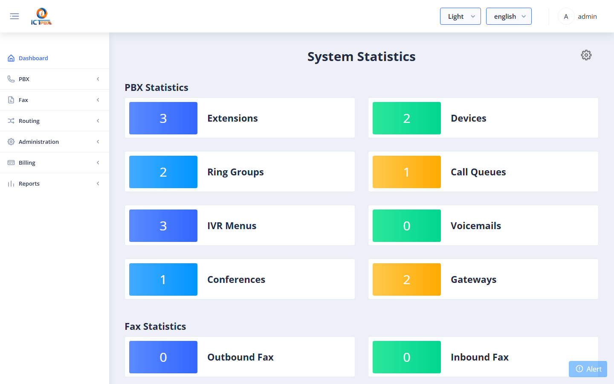

# 1 — Overview

## What is ICTPBX?

ICTPBX is a web-based management portal for:

- **Fax** — send, receive, and route faxes with email delivery
- **PBX** — manage extensions, devices, ring groups, IVR menus, call queues, voicemail, and more
- **Administration** — manage tenants (EE), users, permissions, and resource quotas

It connects a PHP REST API (ICTCore) to a FusionPBX / FreeSWITCH PBX engine, with all configuration changes applied to the live phone system in real time.

---

## Roles

| Role | Can do |
|------|--------|
| **Admin** | Everything — manage all tenants, users, and system settings |
| **Tenant Admin** | Manage users within their own tenant; grant only permissions they hold; allocate quota within their tenant's pool |
| **End User** | Use features they have been granted (send fax, check voicemail, etc.) |

---

## Editions

### Enterprise Edition (EE)

Multi-tenant. The Admin creates **Tenants** (organisations), then creates **Users** under each tenant. Each tenant has its own fax and PBX quota pool. Branding per tenant is supported.

### Community Edition (CE)

Single-tenant. There is one built-in tenant (`tenant_id=1`). The Admin creates Users directly. No billing, no branding configuration, no tenant management menu.

---

## Logging In

Navigate to your ICTPBX URL and enter your email and password.

After login you are taken to the **Dashboard**, which shows a summary of your activity.

The left sidebar shows the menu items available to your role. Items you do not have permission for are automatically hidden.
