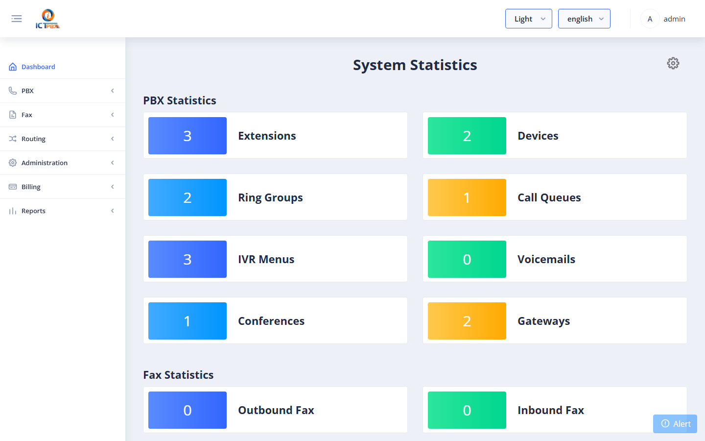

# 1 — Overview

## What is ICTPBX?

ICTPBX is a web-based management portal for:

- **Fax** — send, receive, and route faxes with email delivery
- **PBX** — manage extensions, devices, ring groups, IVR menus, call queues, voicemail, and more, plus a built-in browser softphone
- **Routing** — SIP trunks, outbound routes, DID (inbound) and CID (caller ID) numbers
- **Administration** — manage tenants (Service Provider Edition), users, permissions, and resource quotas
- **Billing** (Service Provider Edition) — packages, subscriptions, rates, payments and usage

It connects a REST API (ICTCore) to a FusionPBX / FreeSWITCH PBX engine. Configuration changes are applied to the live phone system immediately — no restart needed.

---

## Roles

| Role | Can do |
|------|--------|
| **Super Admin** | Everything — manage all tenants, users, trunks, billing and system settings |
| **Tenant Admin** (Service Provider Edition) | Manage users and PBX/fax features within their own tenant; grant only permissions they hold; allocate quota within their tenant's pool |
| **End User** | Use the features they have been granted — their own extension (**PBX → My Extension**), devices, voicemail, send/receive fax, etc. |

A **tenant** is an organisation record, not a login. People log in as **users**, and every user belongs to a tenant.

---

## Editions

### Service Provider Edition (EE)

Multi-tenant. The Super Admin creates **Tenants** (organisations) — each gets its own PBX/SIP domain automatically — then adds a **Tenant Admin** user under each tenant. Each tenant has its own fax and PBX quota pool, billing package and credit, and optional custom branding. Tenants are flat (there are no sub-tenants or resellers). SMS messaging and the AI Voice Agent are also available in this edition.

### Community Edition (CE)

Single-tenant. There is one built-in tenant and the Admin creates users directly. No billing, branding, SMS, AI Voice Agent or tenant management menu.

---

## Logging In

Navigate to your ICTPBX URL and enter your email and password.

After login you are taken to the **Dashboard**, which shows a summary of your activity.

The left sidebar shows the menu items available to your role. Items you do not have permission for are automatically hidden.
