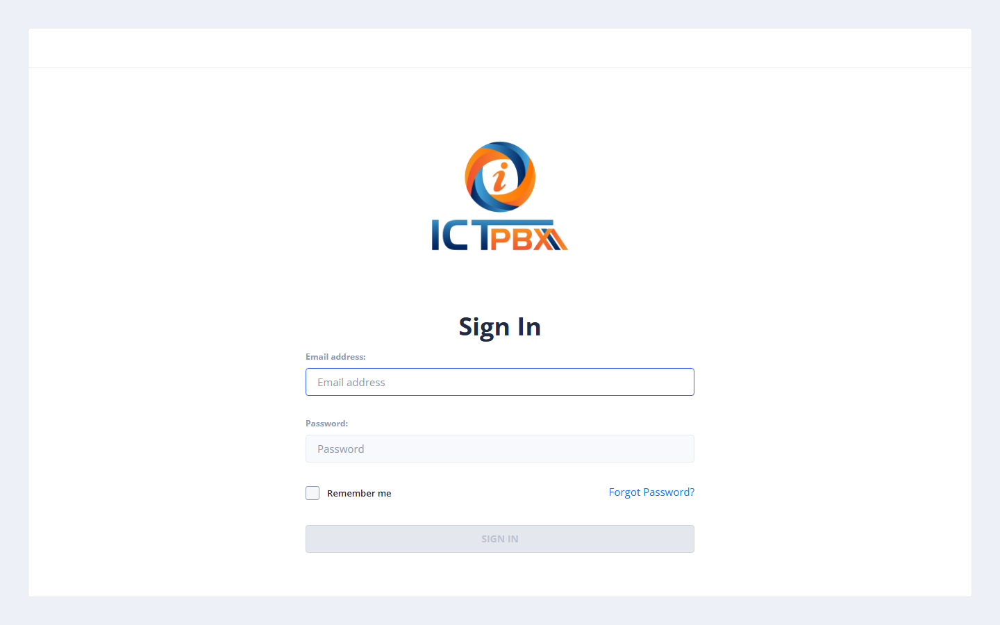

# 2 — Quick Start: Community Edition

The Community Edition is single-tenant. There is no tenant management — the Admin creates users directly and all users share a single PBX domain.

---

## Step 0 — Install

Use a fresh **Rocky Linux 8 or 9** server and run:

```bash
DOMAIN=pbx.example.com TLS_EMAIL=you@example.com \
  bash <(curl -fsSL https://raw.githubusercontent.com/ictinnovations/ictpbx-community-edition-gui/main/install-ce.sh)
```

`DOMAIN` + `TLS_EMAIL` are optional but recommended: the DNS name must already point at the server, and without HTTPS the browser softphone will not work. Open TCP 80/443, **UDP/TCP 5080** (SIP — nothing listens on 5060) and **UDP 16384–32768** (call audio). Installing **fail2ban** is recommended; the installer does not set it up.

---

## Step 1 — Log in as Admin

Go to your ICTPBX URL and log in as **admin@ictcore.org** with the admin password you entered during installation.

The installer also seeds a demo end user, **user@ictcore.org** / `helloUser` — change its password (or delete it) straight away.



---

## Step 2 — Create a User

1. Go to **Administration → User Management**.
2. Click **Add User**.

Fill in user details:

| Field | Description |
|-------|-------------|
| API Username | Login email address |
| Password / Confirm Password | Must meet the password policy |
| First name / Last name | Display name |
| Select Role and tenant | Tick **end_user** for a normal user (the tenant role is not available in CE) |

### Assign Permissions

Check the PBX features the user should be able to access.

3. Click **Submit**.

---

## Step 3 — Add PBX Extensions

1. Go to **PBX → Extensions**.
2. Click **Add Extension**.
3. Enter the **Extension Number** (next free number suggested), **Password / SIP Auth**, **Extension Type** (Voice or Fax) and optionally **Assign to User**, then click **Save**.
4. Register a phone or softphone app with Username = extension, Password = SIP password, Domain = the SIP domain shown in **PBX → My Extension**, Server = your portal hostname, port **5080**. For a desk phone, use **PBX → Devices → Add Device**, then **Add Line** and pick the extension.

---

## Step 4 — Send a Test Fax

1. Log in as the new user.
2. Go to **Fax → Send Fax** and click **New Outbound Fax**.
3. Upload a document, enter a title and the destination number.
4. Click **Send Fax**.

---

## Key Differences from Service Provider Edition

| Feature | CE | Service Provider Edition |
|---------|----|----|
| Multiple tenants | ❌ | ✅ |
| Per-tenant quota | ❌ | ✅ |
| Branding | ❌ | ✅ |
| Billing | ❌ | ✅ |
| SMS messaging | ❌ | ✅ |
| AI Voice Agent | ❌ | ✅ (optional) |
| PBX features | ✅ Full | ✅ Full |
| Fax features | ✅ Full | ✅ Full |
