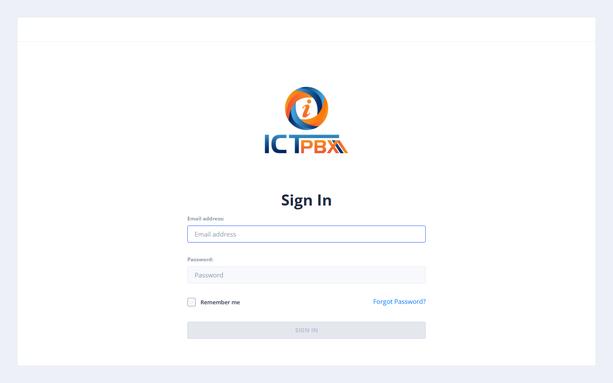
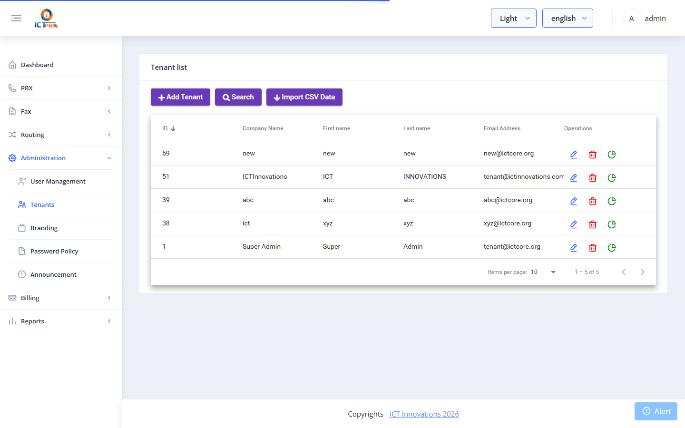
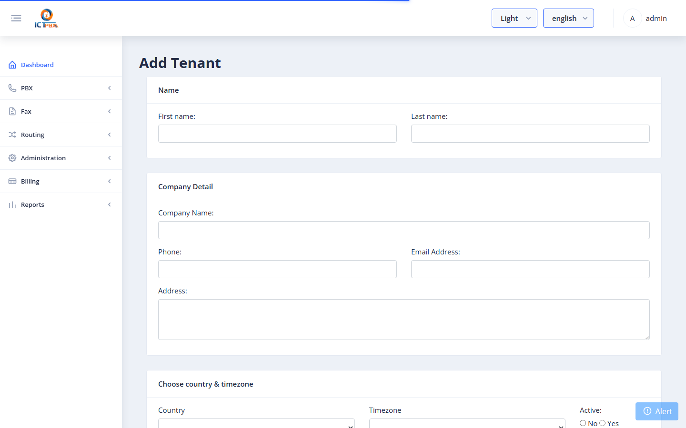
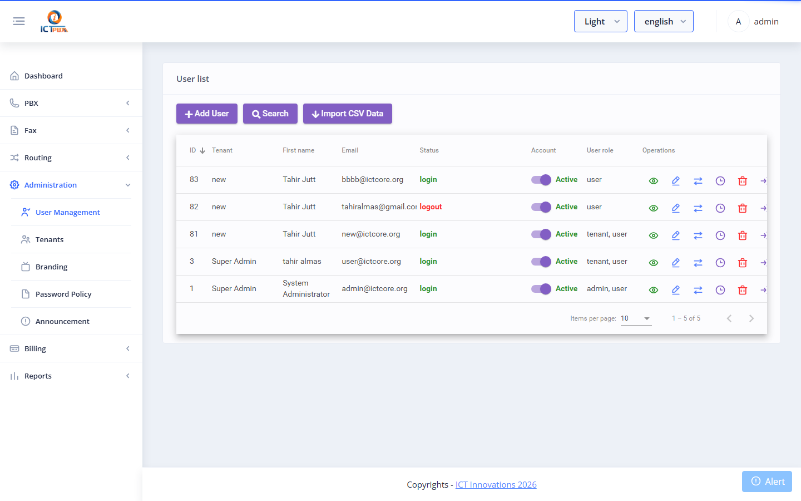
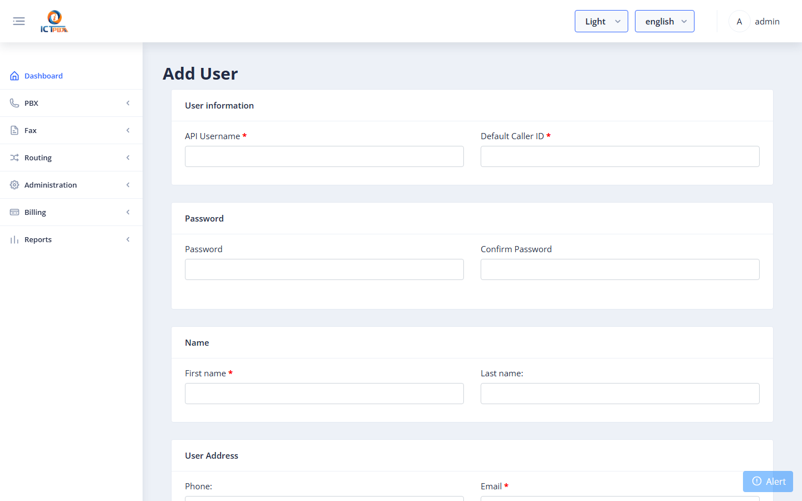
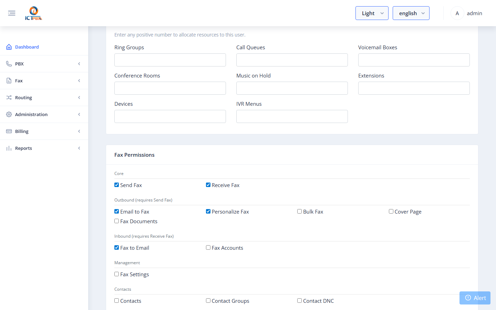
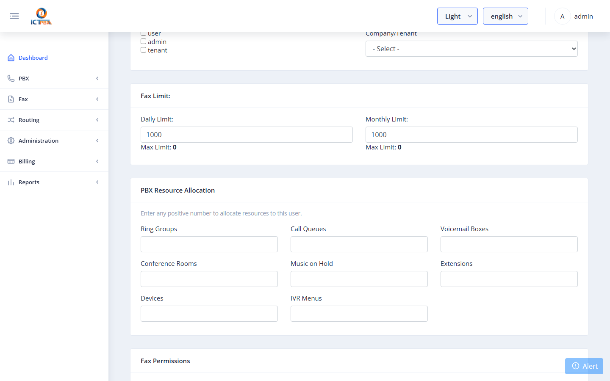

# 2 — Quick Start: Enterprise Edition

> **EE only** — This guide applies to the multi-tenant Enterprise Edition.

Follow these steps to go from a fresh install to a working tenant with a user who can send and receive faxes and use PBX features.

---

## Step 1 — Log in as Admin

Go to your ICTPBX URL and log in with the admin credentials set during installation.

---

## Step 2 — Create a Tenant

A **Tenant** represents an organisation (company). Every user, extension, and fax account belongs to a tenant.

1. Go to **Administration → Tenants** in the left menu.
2. Click **Add Tenant**.

Fill in the tenant details:

| Field | Description |
|-------|-------------|
| Company | Organisation name |
| Email | Primary contact email |
| Phone | Contact phone number |
| Daily Fax Limit | Maximum faxes this tenant can send per day (`-1` = Unlimited) |
| Monthly Fax Limit | Maximum faxes per month (`-1` = Unlimited) |
| Permissions | Which features this tenant's users can access |

3. Select the **Permissions** the tenant should have (e.g. Send Fax, Receive Fax, Extensions, Devices).
4. Click **Save**.

---

## Step 3 — Create a User

1. Go to **Administration → Users**.
2. Click **Add User**.

Fill in user details:

| Field | Description |
|-------|-------------|
| First Name / Last Name | Display name |
| Username | Login email address |
| Password | Must meet the password policy |
| Tenant | Select the tenant created in Step 2 |
| Role | **Tenant** = tenant admin; **User** = end user |

### Assign Permissions

Scroll down to the **Fax Permissions** and **PBX Permissions** cards. Check each feature the user should have access to.

### Allocate PBX Resource Quota

Scroll to **PBX Resource Allocation**. Enter how many PBX objects (extensions, devices, ring groups, etc.) this user can create. As admin you can enter any positive number.

3. Click **Save**.

---

## Step 4 — Configure a Fax Account (DID)

To receive faxes, set up a DID (phone number) account:

1. Go to **Fax → Fax Accounts**.
2. Add a DID account with `type = DID` and the inbound phone number.
3. Add an extension account linked to that DID (`Link DID` field) with the delivery email address.

See [Fax Features → Fax Accounts](06-fax-features.md#fax-accounts) for full details.

---

## Step 5 — Add PBX Extensions

1. Go to **PBX → Extensions**.
2. Click **Add Extension**.
3. Fill in extension number, display name, and password.
4. Provision a SIP device against the extension (see [Devices](05-pbx-features.md#devices)).

The extension is immediately active in FusionPBX / FreeSWITCH.

---

## You're Ready

Users can now log in and:
- Send faxes via **Fax → Send Fax**
- View received faxes in **Fax → Inbox**
- Make and receive calls on their provisioned SIP device
