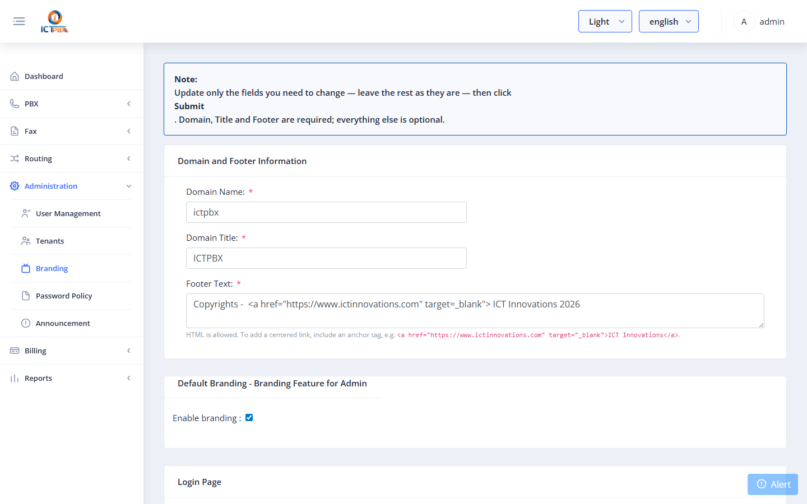
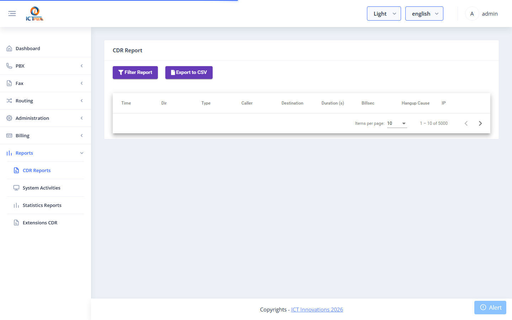

# 3 — Administration Guide

This guide covers tasks performed by the **System Administrator** (admin role).

---

## Tenant Management `EE only`

Tenants represent organisations. Each tenant has its own users, fax quota, PBX domain, and optionally custom branding.

### Viewing Tenants

Go to **Administration → Tenants**.

The list shows each tenant's company name, email, daily/monthly fax limits, and status.

### Creating a Tenant

Click **Add Tenant**.

| Field | Required | Description |
|-------|----------|-------------|
| Company | ✅ | Organisation name |
| Email | ✅ | Primary contact email |
| Phone | | Contact phone |
| Address / City / Country | | Optional location info |
| Daily Fax Limit | | Max faxes/day. `-1` = Unlimited |
| Monthly Fax Limit | | Max faxes/month. `-1` = Unlimited |
| Permissions | | Features available to all users under this tenant |

**Permissions** determine which menu items and actions are available to users under this tenant. Check every feature this organisation should have access to:

- **Fax permissions**: Send Fax, Receive Fax, Fax to Email, Email to Fax, Personalize Fax, Bulk Fax, Cover Page, Fax Documents, Fax Accounts, Fax Settings
- **Contacts permissions**: Contacts, Contact Groups, Contact DNC
- **PBX permissions**: Extensions, Devices, Ring Groups, Call Queues, IVR Menus, Voicemail, Conferences, Time Conditions, Call Flows, Call Block, Follow Me, Music on Hold, Inbound Routes, Realtime

Click **Save**.

### Editing a Tenant

Click the **Edit** (pencil) icon on any tenant row. All fields are editable. Reducing a tenant's permissions does not immediately revoke existing user permissions — those are enforced at login and on save.

### Deleting a Tenant

Click the **Delete** (trash) icon. This removes the tenant record. Associated users should be removed first.

---

## User Management

Users are individuals who log in to ICTPBX. Every user belongs to a tenant.

### Viewing Users

Go to **Administration → Users**.

The list shows username, full name, tenant, role, and status. Use the search field to filter.

### Creating a User

Click **Add User**.

#### Basic Information

| Field | Required | Description |
|-------|----------|-------------|
| First Name | ✅ | |
| Last Name | | |
| Username | ✅ | Used as the login email address |
| Password | ✅ (new users) | Must meet the password policy |
| Confirm Password | ✅ | Must match password |
| Tenant | ✅ | The tenant this user belongs to |
| Role | ✅ | **Tenant** = tenant admin; **User** = end user |
| Timezone | | Used for scheduling and call routing |

#### Fax Quota

| Field | Description |
|-------|-------------|
| Daily Fax Limit | Max faxes this user can send per day. Cannot exceed the tenant's remaining daily pool. `-1` = Unlimited (admin only). |
| Monthly Fax Limit | Max faxes per month. Same constraints. |

#### Permissions

Scroll to the **Fax Permissions** and **PBX Permissions** cards and check each feature to enable.

Permissions are grouped by category. Only permissions the tenant holds are visible.

#### PBX Resource Allocation

The **PBX Resource Allocation** card appears directly below the PBX Permissions card. It shows one quota input for each PBX permission that is **checked** in the form above — unchecked permissions produce no input row.

| Resource | Appears when permission is checked |
|----------|------------------------------------|
| Extensions | Extensions |
| Devices | Devices |
| Ring Groups | Ring Groups |
| Call Queues | Call Queues |
| IVR Menus | IVR Menus |
| Voicemail Boxes | Voicemail |
| Conferences | Conferences |
| Music on Hold | Music on Hold |

As admin there is no upper cap — enter any positive integer. Unchecking a PBX permission automatically zeros its quota field. The allocated quota is enforced at object-creation time: if a user has used their full extension allocation, creating another extension returns a quota error.

Click **Save** (or **Update** when editing).

### Editing a User

Click **Edit** on any user row. All fields including permissions and quotas are editable.

### Deleting a User

Click **Delete** on any user row.

### Password Policy

Go to **Administration → Password Policy** to set requirements:
- Minimum length
- Uppercase / lowercase / numeric / special character requirements
- Password expiry (days)
- Maximum failed login attempts before lockout

---

## Branding `EE only`

Branding lets you customise the portal appearance per tenant.

Go to **Administration → Branding**.

| Field | Description |
|-------|-------------|
| Domain | Hostname this branding applies to (matched at login) |
| Title | Browser tab / page title |
| Logo | Uploaded image shown in the header |
| Favicon | Browser tab icon URL |
| Login Subtitle | Tagline shown below the logo on the login page |
| Support Email | Shown in the footer |
| Login Background | URL of the login page background image |
| Footer | HTML content shown at the bottom of every page |
| Theme Lock | Force a specific Nebular theme; hides the user's theme dropdown |

The **Default** flag marks the fallback branding used when no domain match is found.

---

## Billing & Quota `EE only`

Go to **Billing → Quota** to view resource usage across all tenants.

The quota page shows for each tenant: fax daily/monthly limits, assigned vs remaining, and PBX slot usage per resource type.

---

## CDR Reports

Go to **Reports → CDR** to view call and fax detail records.

Filter by date range, tenant, user, or direction. Export to CSV for billing or compliance purposes.

---

## Gateways (Trunks)

Go to **PBX → Gateways** to manage SIP trunks connecting to your telecom carrier.

Each gateway maps to a SIP provider. ICTPBX writes the gateway configuration directly to FusionPBX and materialises the SIP profile XML on disk, then reloads FreeSWITCH automatically.

See [PBX Features → Gateways](05-pbx-features.md#gateways) for field-level details.
