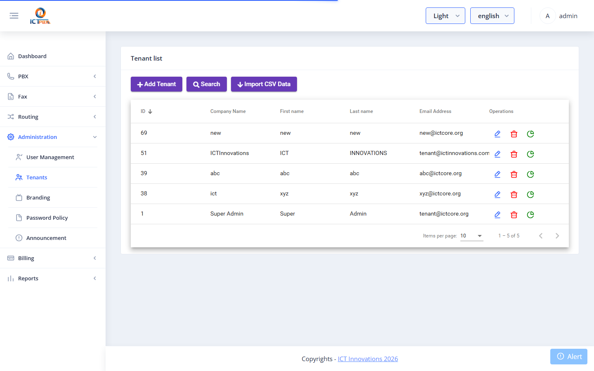
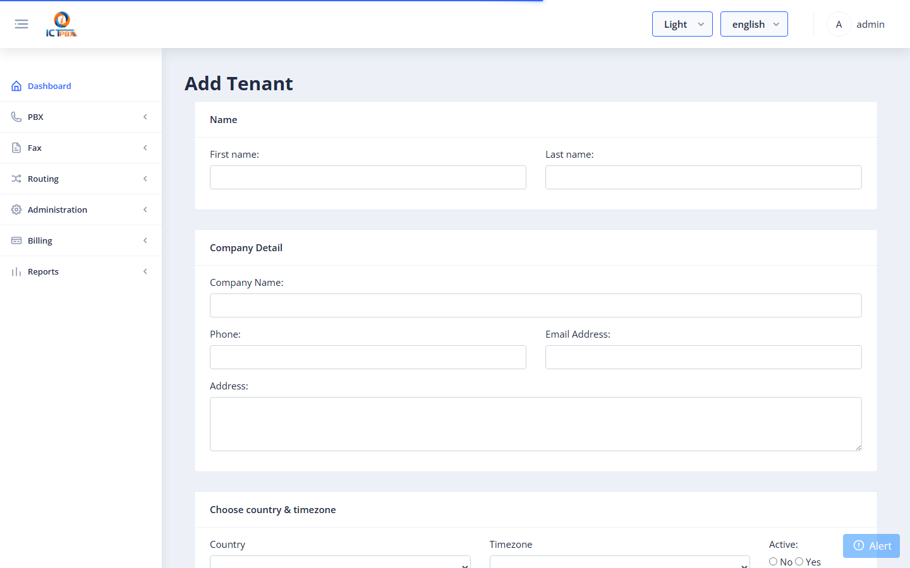
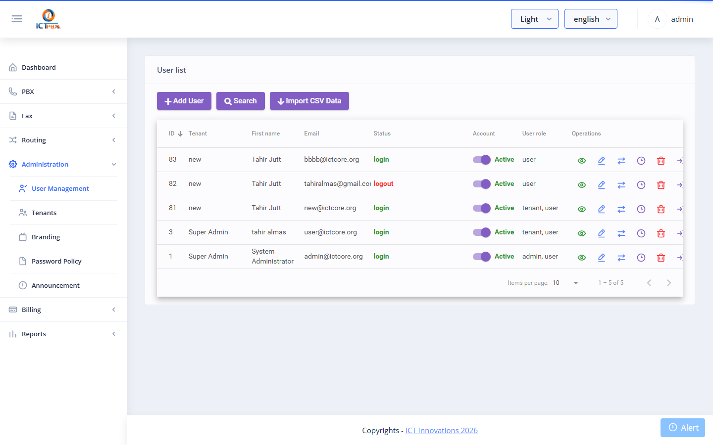
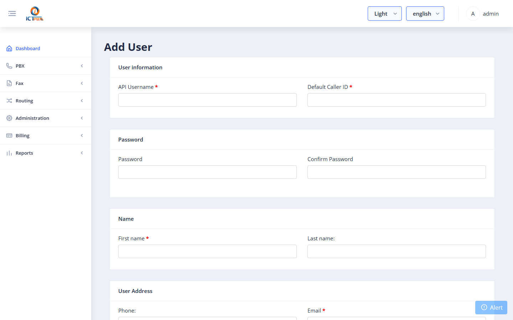
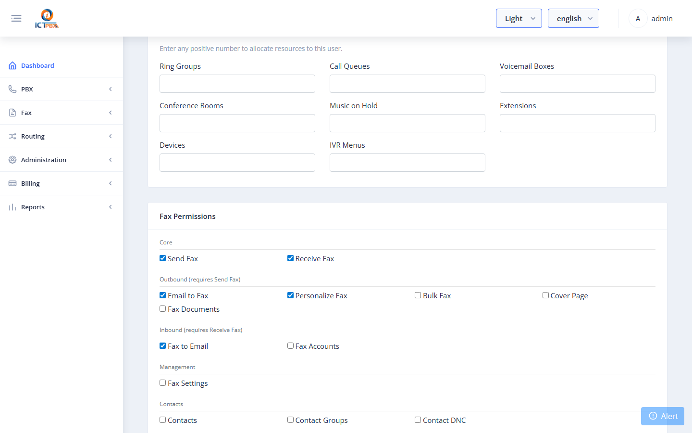
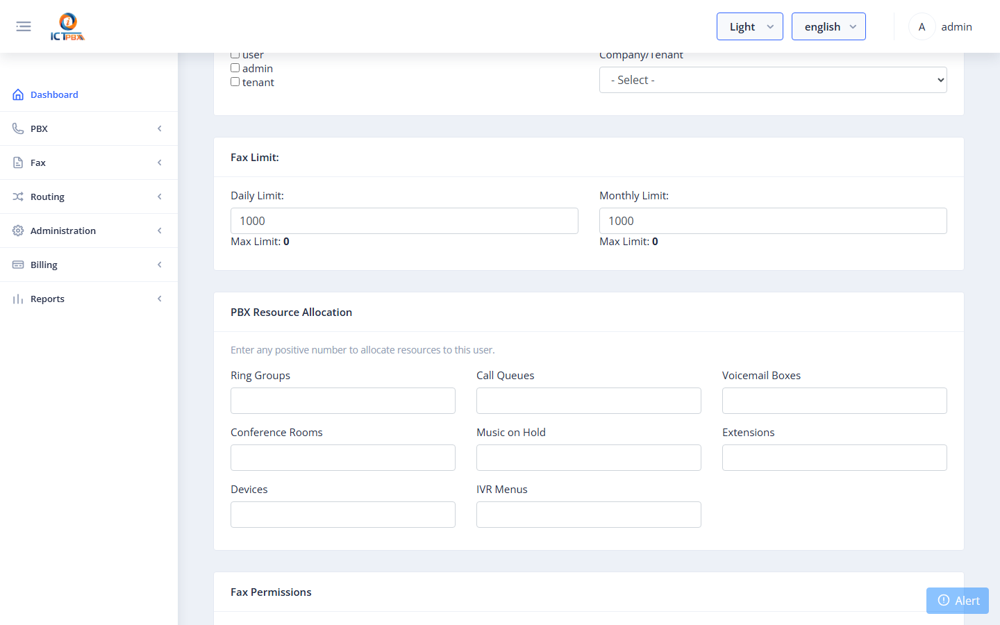
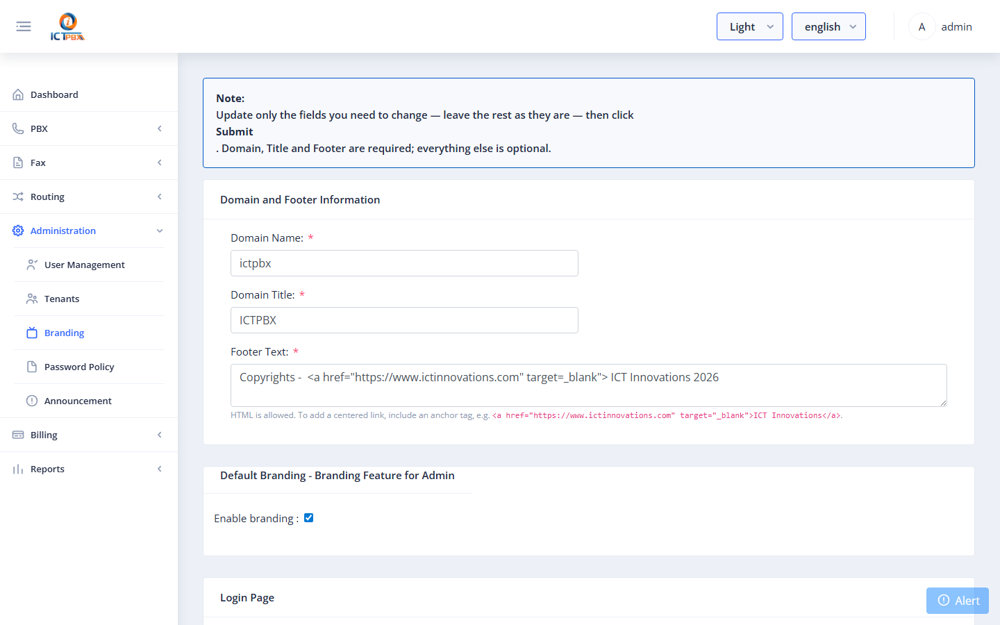
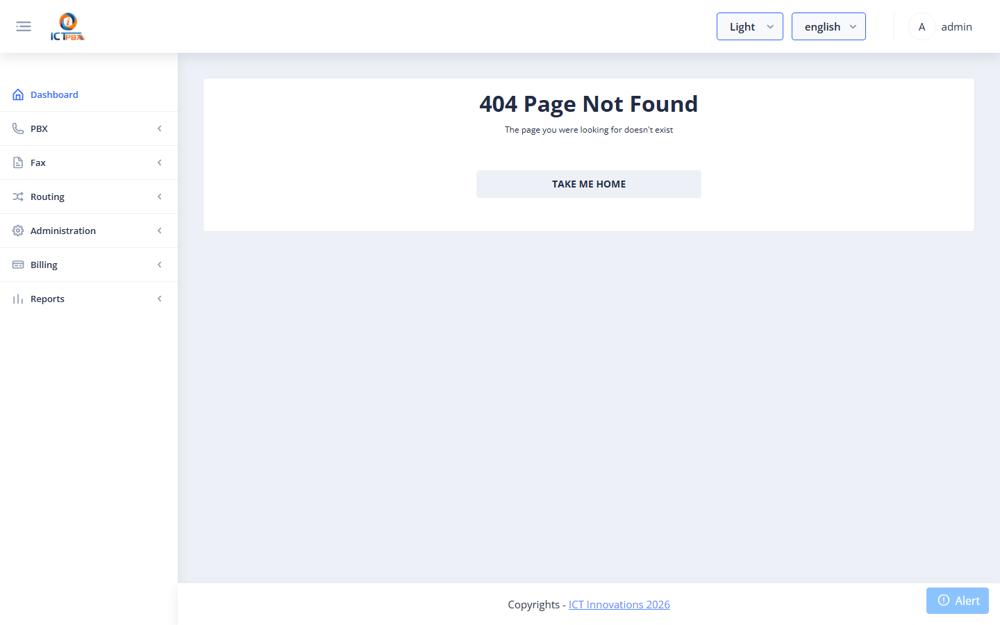
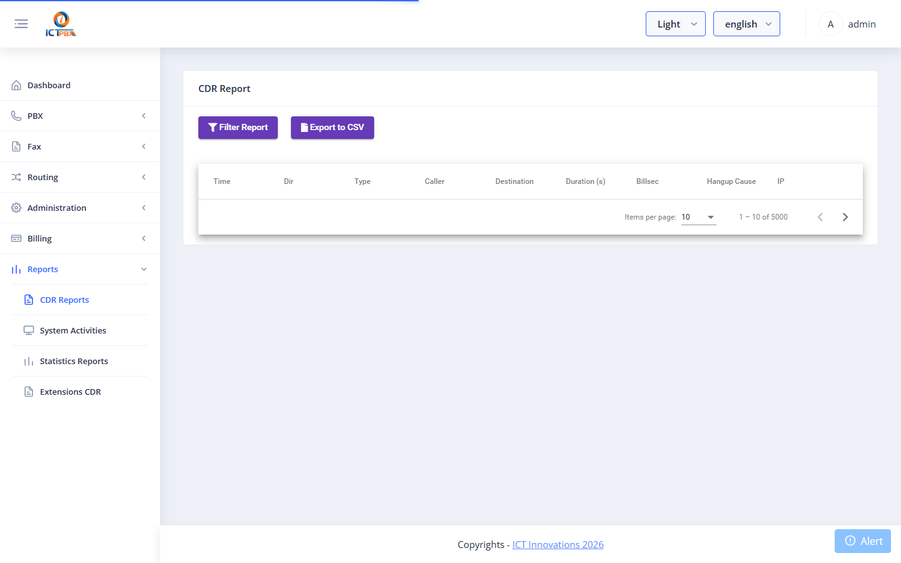

# 3 — Administration Guide

This guide covers tasks performed by the **Super Admin**.

---

## Tenant Management (Service Provider Edition)

Tenants represent organisations. Each tenant has its own users, fax quota, PBX domain, billing package and credit, and optionally custom branding. A tenant is an organisation record only — it has no login. After creating a tenant, add a **Tenant Admin** user for it (see [User Management](#user-management)). Tenants are flat: there are no sub-tenants or resellers.

### Viewing Tenants

Go to **Administration → Tenants**.

The list shows each tenant's company name, email, daily/monthly fax limits, and status.

### Creating a Tenant

Click **Add Tenant**.

| Field | Required | Description |
|-------|----------|-------------|
| Company Name | ✅ | Organisation name |
| First name / Last name | | Primary contact |
| Email Address | ✅ | Primary contact email |
| Phone | | Contact phone |
| Address / Country / Timezone | | Optional location info |
| Active | | Enable or disable the tenant |
| Daily Limit / Monthly Limit | | Max faxes per day / month. `-1` = Unlimited |
| Low-credit alert threshold | | Email the tenant when credit drops below this value. `0` = disabled |
| Max concurrent calls | | Simultaneous active calls allowed for this tenant. `0` = unlimited |
| Resource Quotas | | Extensions, Devices, Ring Groups, Call Queues, Conferences, IVR Menus, Voicemail Boxes, Music on Hold |
| Permissions | | Features available to users under this tenant |

**Permissions** determine which menu items and actions are available to users under this tenant. Check every feature this organisation should have access to:

- **Fax permissions**: Send Fax, Receive Fax, Fax to Email, Email to Fax, Personalize Fax, Bulk Fax, Cover Page, Fax Documents, Fax Settings
- **Contacts permissions**: Contacts, Contact Groups, Contact DNC
- **PBX permissions**: Extensions, Devices, Ring Groups, Call Queues, IVR Menus, Voicemail, Conferences, Time Conditions, Call Flows, Call Block, Follow Me, Music on Hold, Inbound Routes, Realtime

Click **Submit**. The tenant's own PBX/SIP domain (e.g. `acme.local`) is created automatically, so extension numbers only need to be unique within a tenant.

### Editing a Tenant

Click the **Edit** (pencil) icon on any tenant row, change the fields and click **Update**. Reducing a tenant's permissions does not immediately revoke existing user permissions — those are enforced at login and on save. Tenant Admins cannot edit their own tenant record.

### Deleting a Tenant

Click the **Delete** (trash) icon. This removes the tenant record. Associated users should be removed first.

---

## User Management

Users are individuals who log in to ICTPBX. Every user belongs to a tenant. There are three roles: **Super Admin**, **Tenant Admin** and **End User**.

### Viewing Users

Go to **Administration → User Management**.

The list shows username, full name, tenant, role, and status. Use the search field to filter.

### Creating a User

Click **Add User**.

#### Basic Information

| Field | Required | Description |
|-------|----------|-------------|
| API Username | ✅ | Used as the login email address |
| Default Caller ID | | Caller ID used for this user's outbound calls/faxes |
| Password | ✅ (new users) | Must meet the password policy |
| Confirm Password | ✅ | Must match password |
| First name | ✅ | |
| Last name | | |
| Phone / Email / Address | | Contact details |
| Country / Timezone | | Timezone is used for scheduling and reports |
| Active | | Enable or disable the login |

#### Select Role and tenant

Only the Super Admin sees this card. Tick **tenant** to make the user a **Tenant Admin**, or **end_user** for an **End User**, and choose the **Tenant** the user belongs to. The Super Admin role cannot be assigned from this form.

#### Fax Quota (Service Provider Edition)

| Field | Description |
|-------|-------------|
| Daily Limit | Max faxes this user can send per day. Cannot exceed the tenant's remaining daily pool. `-1` = Unlimited (admin only). |
| Monthly Limit | Max faxes per month. Same constraints. |

#### Permissions

Scroll to the **Fax Permissions** and **PBX Permissions** cards and check each feature to enable.

Permissions are grouped by category. Permissions the selected tenant does not hold are greyed out. (Community Edition shows the PBX Permissions card only.) **PBX Permissions** and **PBX Resource Allocation** are hidden for End Users — End Users manage only their own extension, devices, follow-me and voicemail.

#### PBX Resource Allocation (Service Provider Edition)

The **PBX Resource Allocation** card appears directly below the PBX Permissions card. It shows one quota input for each PBX permission that is **checked** in the form above — unchecked permissions produce no input row.

| Resource | Appears when permission is checked |
|----------|------------------------------------|
| Extensions | Extensions |
| Devices | Devices |
| Ring Groups | Ring Groups |
| Call Queues | Call Queues |
| IVR Menus | IVR Menus |
| Voicemail Boxes | Voicemail |
| Conferences | Conferences |
| Music on Hold | Music on Hold |

As Super Admin there is no upper cap — enter any positive integer. Unchecking a PBX permission automatically zeros its quota field. The allocated quota is enforced at object-creation time: if a user has used their full extension allocation, creating another extension returns a quota error.

Click **Submit** (or **Update** when editing).

### Editing a User

Click **Edit** on any user row. All fields including permissions and quotas are editable.

### Deleting a User

Click **Delete** on any user row.

### Password Policy

Go to **Administration → Password Policy** to set requirements:
- Minimum length
- Minimum uppercase / lowercase / numeric / special characters
- Password expiry and expiry notification
- Maximum failed login attempts before lockout
- Password history and session timeout

### Announcement

Go to **Administration → Announcement** to publish a message shown to users in the portal.

### API Keys

Go to **Administration → API Keys** and click **New API Key** to allow programmatic access to the REST API. Enter a **Name**, an optional **Rate limit** (requests/min, `0` = unlimited) and optional **Expires** date, then click **Create**. Copy the key immediately — it is shown only once. Send it as the `X-API-Key` header on API requests; the key acts with its user's permissions. Click **Revoke** to disable a key.

---

## Branding (Service Provider Edition)

Branding lets you customise the portal appearance per tenant. Only the Super Admin can manage branding.

Go to **Administration → Branding** and **Select Tenant**.

| Field | Description |
|-------|-------------|
| Domain Name | Hostname this branding applies to (matched at login) |
| Domain Title | Browser tab / page title |
| Footer Text | Content shown at the bottom of every page |
| Login Subtitle | Shown beneath "Sign In" on the login page |
| Support Email | Shown to users in error messages on the login page |
| Login Background URL | Optional full-page background image for the login page |
| Favicon URL | Browser tab icon (32×32 or 64×64 PNG) |
| Locked Theme | Force all tenant users onto one theme and hide the theme switcher |
| Upload Logo | Image shown in the header |

The **Default Branding** option marks the fallback branding used when no domain match is found.

---

## Billing (Service Provider Edition)

Billing is driven by **packages**. Each package sets:

- **PBX slot limits** (extensions, devices, ring groups, etc.) — hard limits; creating more is refused.
- **Voice minutes, fax pages and conference minutes included free each month.** Usage above the free amount is charged at your rates and deducted from the tenant's credit. Usage is processed hourly and the free allowance resets each month. Calls are **not** cut off when credit reaches zero — use the tenant's **Low-credit alert threshold** to be warned.

| Menu | Purpose |
|------|---------|
| **Billing → Rate Plans** | Per-unit rates (by service, billing block and rate) |
| **Billing → Plans** | Groups of rates assigned to packages |
| **Billing → Packages** | Click **+ New Package**; set Name, Billing Interval, Rate Plan and **Resource Limits** (`0` = unlimited). A package can't be deleted while a tenant is subscribed to it |
| **Billing → Subscriptions** | Per tenant: **Change Package** (takes effect immediately), **Suspend** / **Activate** |
| **Billing → Payments** | Record a payment against a tenant (Cash, Cheque, Online Payment, Other) — it adds to the tenant's credit |
| **Billing → Quota** | Slot usage and monthly usage allowance per resource |
| **Billing → Usage** | Usage and charges |

---

## CDR Reports

Go to **Reports → CDR Reports** to view call and fax detail records.

Filter by date range, tenant, user, or direction. Export to CSV for billing or compliance purposes.

Other reports: **PBX CDR** (raw PBX call records, Super Admin only), **System Activities**, **Statistics Reports** and **Extensions CDR**.

---

## Trunks

Go to **Routing → Provider / Trunks** to manage SIP trunks connecting to your telecom carrier. Trunks are managed by the Super Admin only and shared by all tenants.

Enter the **Provider Name**, **Gateway Type** (SIP), **Username** / **Password**, **Host / Proxy**, **Port** and whether to **Register**. Saving applies the trunk to the phone system immediately — no restart needed. (The old **PBX → Gateways** menu has been removed.)

Then use:

- **Routing → Routes** — outbound routes: which trunk carries which service and destinations.
- **Routing → DID Numbers** — add inbound numbers (one at a time, in batch, or by import) and assign them to tenants.
- **Routing → CID Numbers** — caller ID numbers that can be assigned for outbound calls.

Phones, softphones and trunks use SIP port **5080** (UDP/TCP); nothing listens on 5060.
