# 5 — PBX Features

All PBX features write directly to FusionPBX / FreeSWITCH and take effect immediately — no restart required. Each feature requires the corresponding permission to be enabled on your account.

---

## Extensions

**Permission required:** `Extensions`

Extensions are SIP endpoints (users/phones) registered in FreeSWITCH. Every device, ring group, queue agent, and voicemail box is associated with an extension.

### List

Go to **PBX → Extensions**.

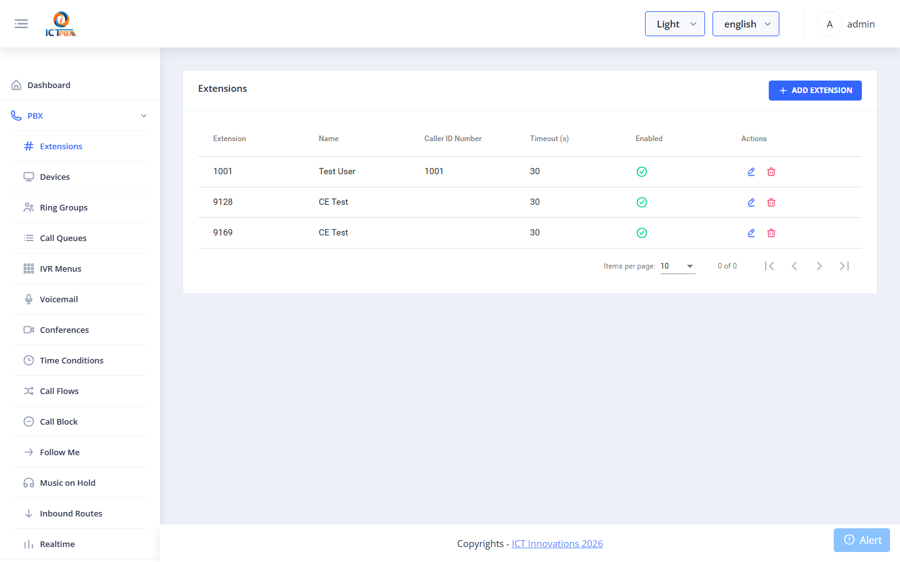

The list shows extension number, display name, and tenant. Use the search bar to filter.

### Add / Edit Extension

Click **Add Extension** or the edit icon.

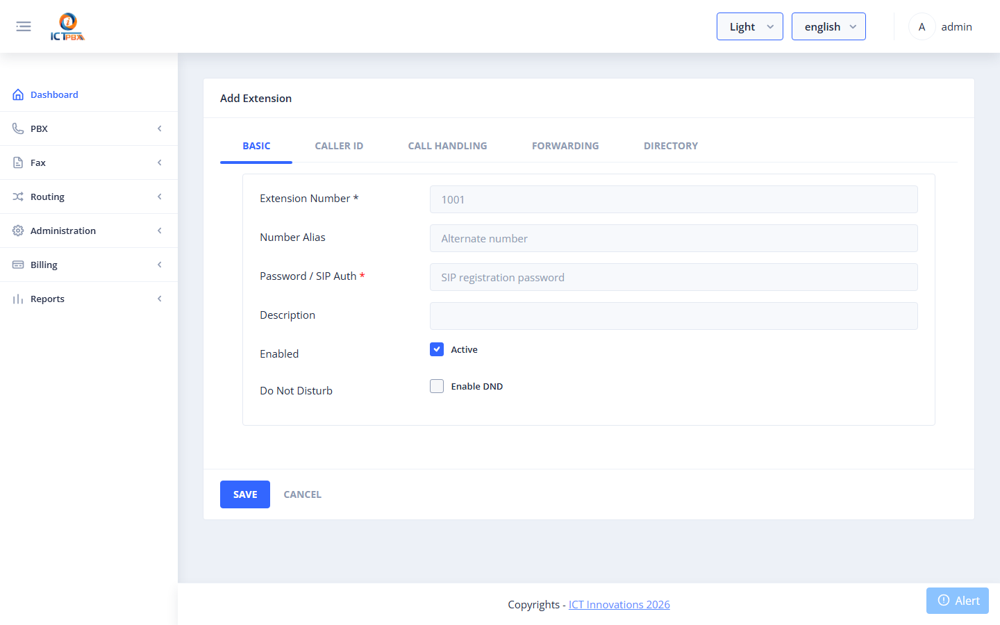

| Field | Required | Description |
|-------|----------|-------------|
| Extension | ✅ | The SIP extension number (e.g. `1001`) |
| Password | ✅ | SIP registration password |
| Display Name | | Name shown on caller ID |
| Voicemail Password | | PIN for voicemail access (default = extension number) |
| Enabled | | Whether the extension is active |

After saving, provision a SIP phone or softphone with:
- **SIP Server**: your ICTPBX server IP/hostname
- **Username**: the extension number
- **Password**: the SIP password set above

---

## Devices

**Permission required:** `Devices`

Devices are physical or software SIP phones registered against extensions.

### List

Go to **PBX → Devices**.

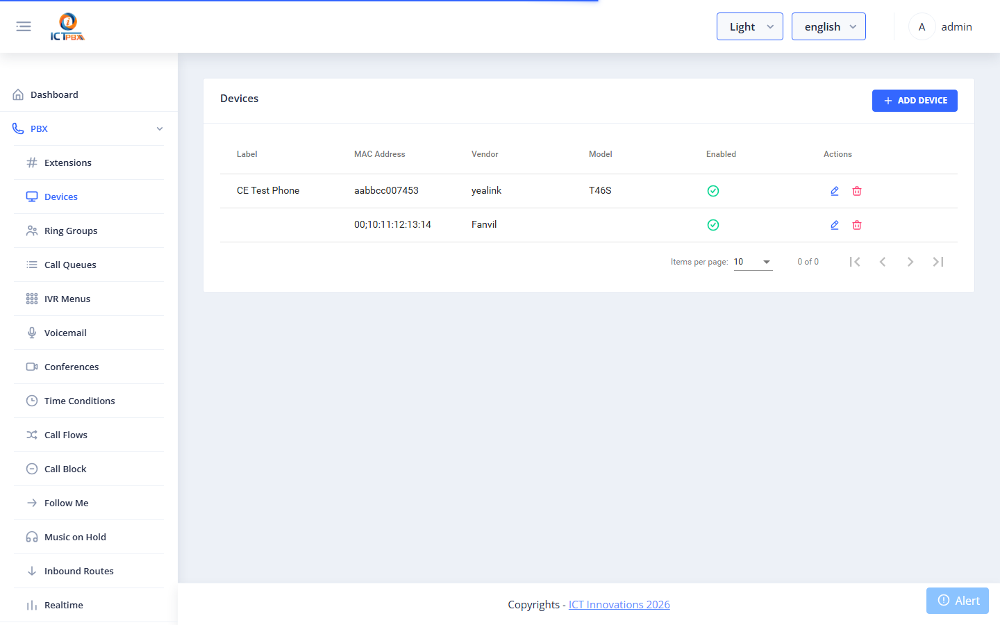

### Add / Edit Device

Click **Add Device** or the edit icon.

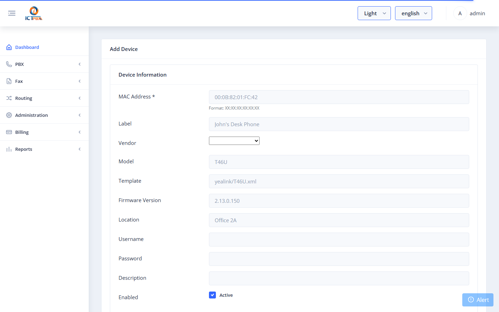

| Field | Required | Description |
|-------|----------|-------------|
| Device MAC | ✅ | MAC address of the physical phone (used for auto-provisioning) |
| Username | ✅ | SIP username (usually the extension number) |
| Template | | Auto-provisioning template (e.g. Yealink, Polycom) |
| Enabled | | Active/inactive |

**Lines tab**: Assign the device to one or more extensions by selecting them in the Lines section.

---

## Ring Groups

**Permission required:** `Ring Groups`

Ring groups ring multiple extensions simultaneously or sequentially when a number is dialled.

### List

Go to **PBX → Ring Groups**.

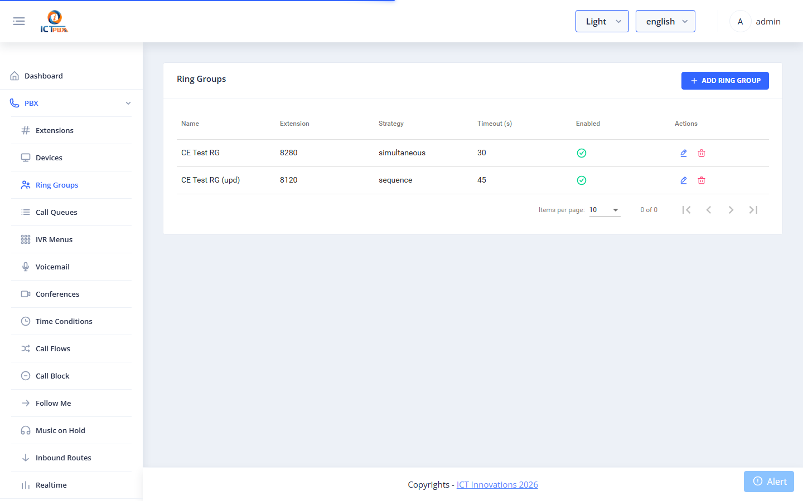

### Add / Edit Ring Group

| Field | Required | Description |
|-------|----------|-------------|
| Name | ✅ | Descriptive name |
| Extension | ✅ | The number callers dial to reach this group |
| Strategy | ✅ | `simultaneous` — all ring at once; `sequence` — one at a time |
| Timeout | ✅ | Seconds to ring before going to timeout destination |
| Timeout Destination | | Where to send the call if unanswered (voicemail, IVR, etc.) |
| Members | ✅ | Extensions to include; each has its own ring timeout |

---

## Call Queues

**Permission required:** `Call Queues`

Call queues place callers in a waiting line, distributing them to available agents.

### List

Go to **PBX → Call Queues**.

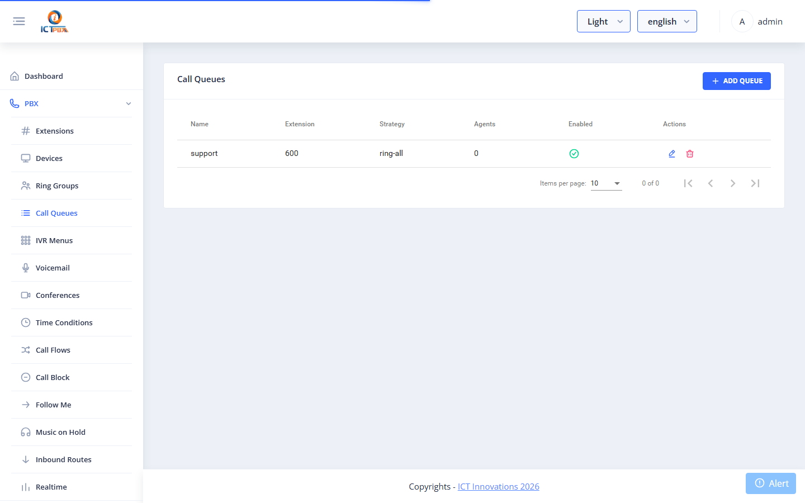

### Add / Edit Call Queue

| Field | Required | Description |
|-------|----------|-------------|
| Name | ✅ | Queue name |
| Extension | ✅ | Number callers dial to enter the queue |
| Strategy | ✅ | `ring-all`, `longest-idle-agent`, `round-robin`, `top-down`, `agent-with-fewest-calls`, `random` |
| Max Wait Time | | Seconds before caller is sent to timeout destination |
| Max No-Answer | | Times an agent can miss before being removed from the queue |
| Agents | ✅ | Extensions serving this queue; each can have a `tier level` and `tier position` |
| MOH Sound | | Music on hold played while waiting |
| Timeout Destination | | Where to route calls that exceed max wait time |

---

## IVR Menus

**Permission required:** `IVR Menus`

IVR (Interactive Voice Response) menus present callers with a recorded greeting and keypad options that route to other destinations.

### List

Go to **PBX → IVR Menus**.

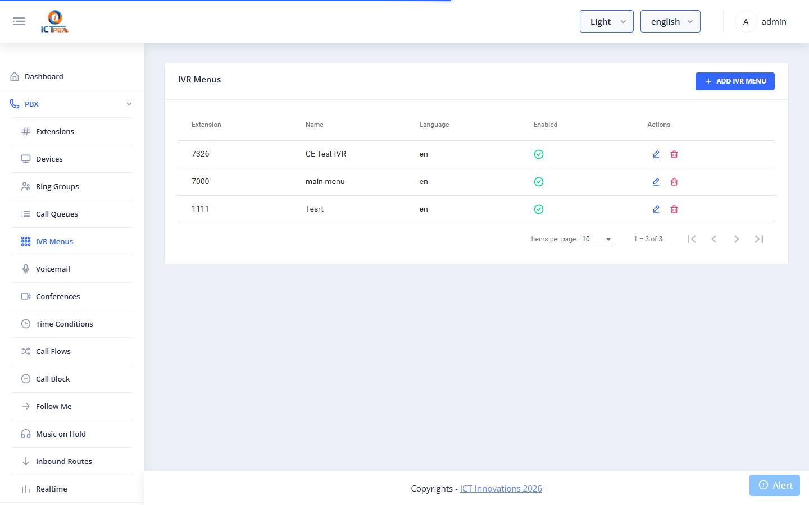

### Add / Edit IVR Menu

| Field | Required | Description |
|-------|----------|-------------|
| Name | ✅ | Menu name |
| Greeting | ✅ | Audio file played when callers enter |
| Invalid Sound | | Audio played on wrong key press |
| Exit Sound | | Audio played on exit |
| Timeout | ✅ | Seconds to wait for input before re-playing greeting |
| Exit Action | | Destination if max retries exceeded |
| Options | ✅ | Key → Destination mappings (e.g. `1` → Sales ring group, `2` → Support queue, `0` → Operator extension) |

---

## Voicemail

**Permission required:** `Voicemail`

Voicemail boxes store recorded messages left by callers. Each box is linked to an extension.

### List

Go to **PBX → Voicemail**.

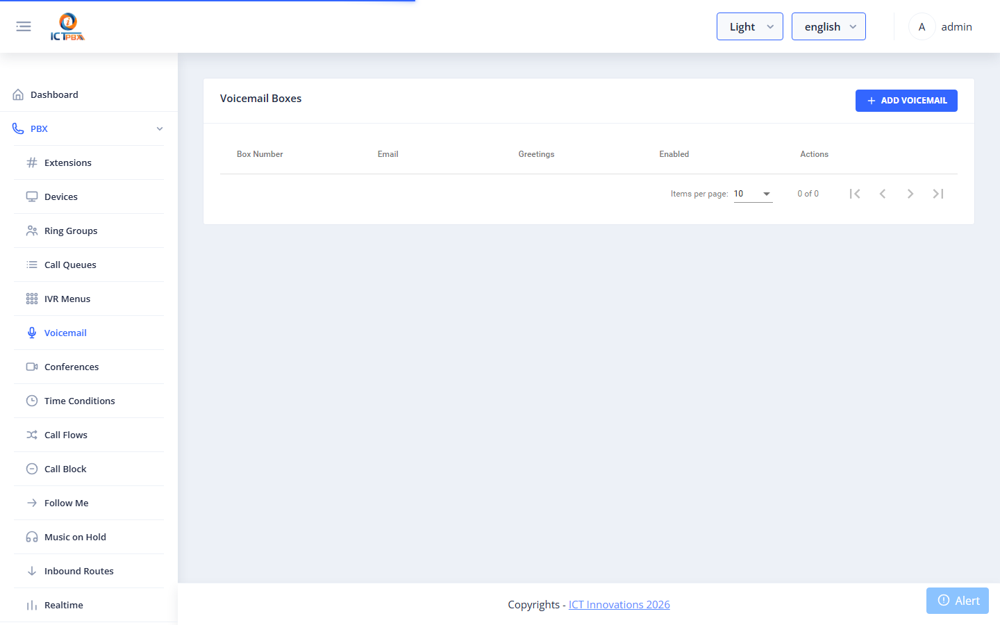

### Add / Edit Voicemail Box

| Field | Required | Description |
|-------|----------|-------------|
| Extension | ✅ | The extension this mailbox belongs to |
| Password | ✅ | PIN to retrieve messages |
| Email | | Address to receive message notifications (with attachment) |
| Greeting | | Custom greeting audio file |
| Enabled | | Active/inactive |

Callers reach voicemail when their call is not answered and the extension forwards to `voicemail` (configured in the extension's no-answer destination in FusionPBX).

---

## Conferences

**Permission required:** `Conferences`

Conference rooms allow multiple callers to join a shared audio bridge by dialling an extension.

### List

Go to **PBX → Conferences**.

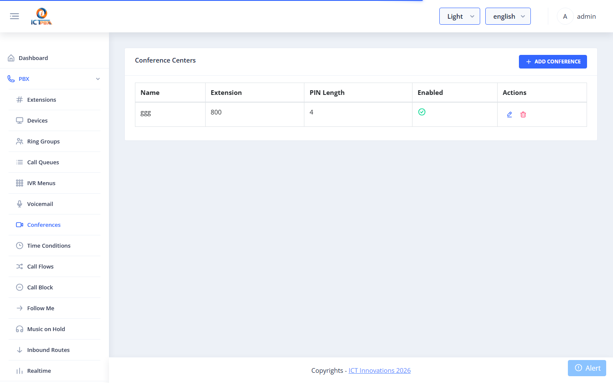

### Add / Edit Conference

| Field | Required | Description |
|-------|----------|-------------|
| Name | ✅ | Room name |
| Extension | ✅ | Number callers dial to join |
| PIN | | Optional entry PIN |
| Admin PIN | | Moderator PIN (moderators can control the conference) |
| Max Members | | Maximum simultaneous participants |
| Enabled | | Active/inactive |

---

## Music on Hold

**Permission required:** `Music on Hold`

Music on Hold (MOH) categories hold audio files played to callers placed on hold or waiting in a queue.

### List

Go to **PBX → Music on Hold**.

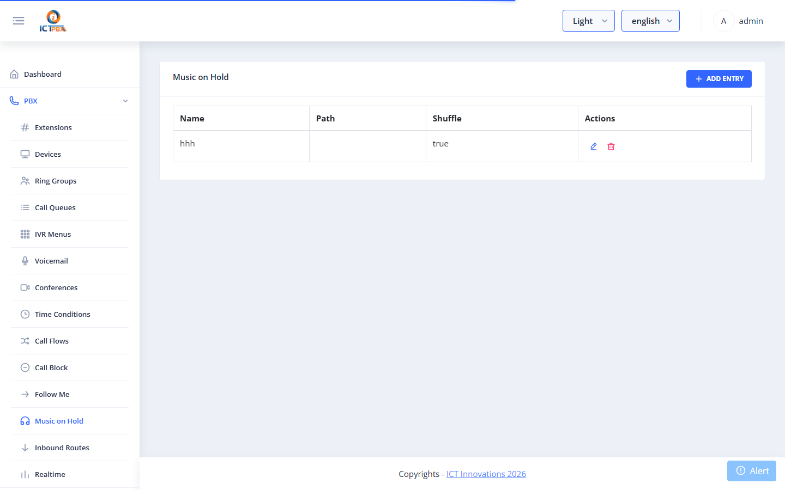

### Add / Edit MOH Category

| Field | Required | Description |
|-------|----------|-------------|
| Name | ✅ | Category name (referenced by queues and ring groups) |
| Rate | | Audio sample rate (8000 Hz default) |
| Shuffle | | Play files in random order |
| Files | | Upload `.wav` or `.mp3` audio files |

---

## Follow Me

**Permission required:** `Follow Me`

Follow Me forwards calls from an extension to one or more destinations in sequence or simultaneously — useful for mobile workers.

### List

Go to **PBX → Follow Me**.

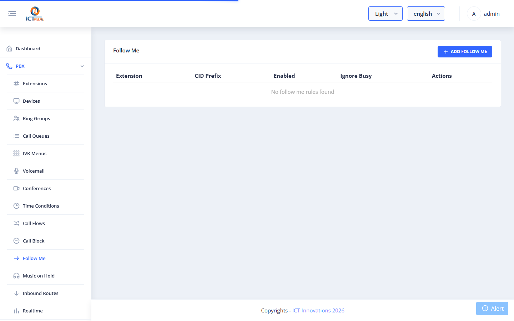

### Add / Edit Follow Me

| Field | Required | Description |
|-------|----------|-------------|
| Extension | ✅ | The source extension to forward from |
| Destinations | ✅ | Phone numbers or extensions to forward to; each has a timeout and delay |
| Strategy | | `simultaneous` or `sequence` |
| Prompt | | Whether to ask the receiving party to accept the call |

---

## Call Flows

**Permission required:** `Call Flows`

Call Flows are toggleable routing rules — a single extension can be switched between two destinations (e.g. normal hours → queue; after hours → voicemail). Useful for on/off-duty toggles.

### List

Go to **PBX → Call Flows**.

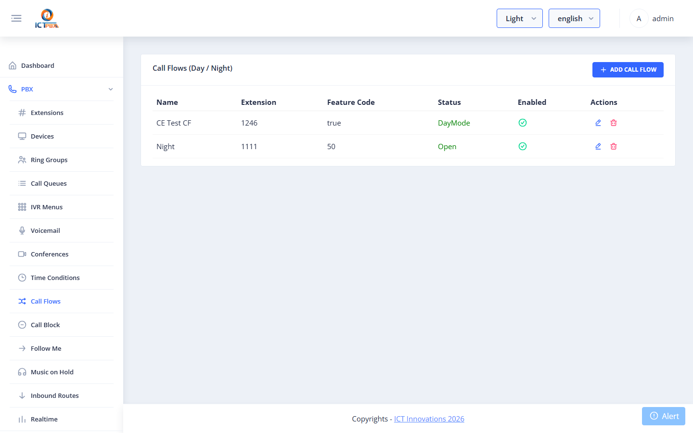

### Add / Edit Call Flow

| Field | Required | Description |
|-------|----------|-------------|
| Name | ✅ | Descriptive name |
| Extension | ✅ | The number that triggers this flow |
| Status | | `Active` (routes to Active Destination) or `Inactive` (routes to Inactive Destination) |
| Active Destination | ✅ | Where to route when the flow is active |
| Inactive Destination | ✅ | Where to route when the flow is inactive |

Toggle the flow status between Active/Inactive to redirect calls on the fly.

---

## Time Conditions

**Permission required:** `Time Conditions`

Time Conditions automatically route calls based on day/time, enabling business-hours routing without manual intervention.

### List

Go to **PBX → Time Conditions**.

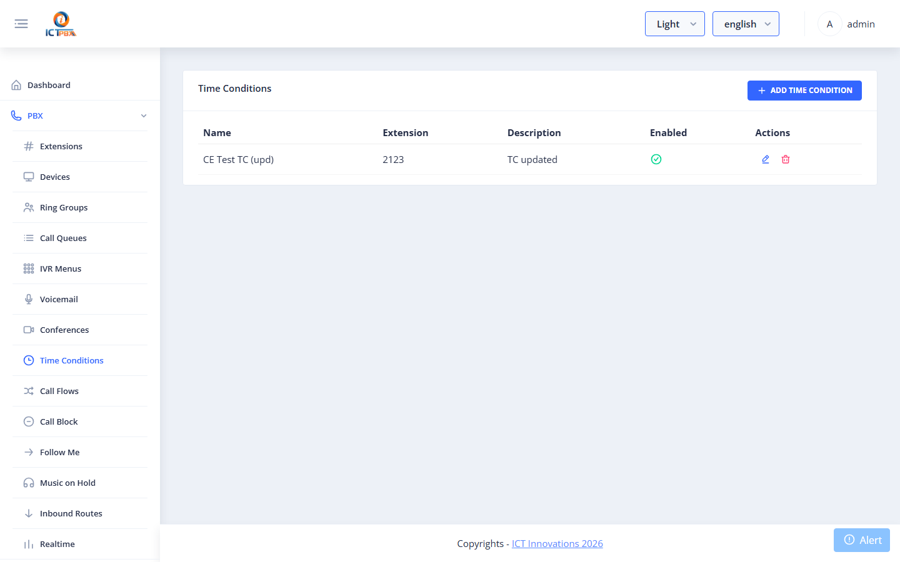

### Add / Edit Time Condition

| Field | Required | Description |
|-------|----------|-------------|
| Name | ✅ | Descriptive name |
| Extension | ✅ | The number this condition is applied to |
| Match Destination | ✅ | Where to route when within the time window |
| No-Match Destination | ✅ | Where to route outside the time window |
| Time Rules | ✅ | One or more time windows: days of week, start time, end time |

Multiple time rules are OR-combined — the condition matches if any rule matches the current time.

---

## Call Block

**Permission required:** `Call Block`

Call Block allows you to reject calls from specific numbers or number patterns.

### List

Go to **PBX → Call Block**.

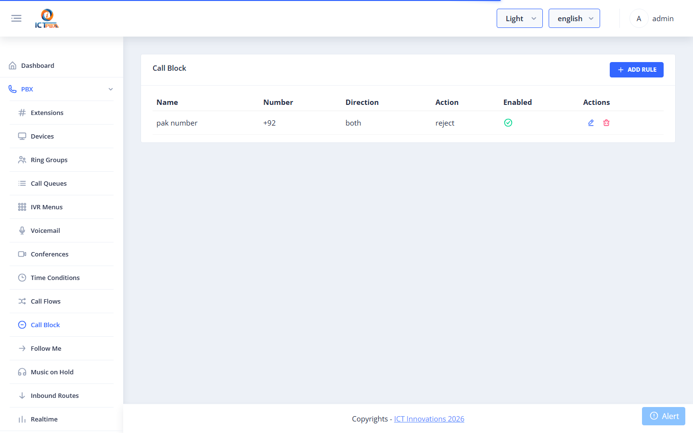

### Add / Edit Block Rule

| Field | Required | Description |
|-------|----------|-------------|
| Number | ✅ | The number to block (exact match or pattern) |
| Action | ✅ | `Hangup`, `Busy`, or `Play message` |
| Description | | Note about why this number is blocked |
| Enabled | | Active/inactive |

---

## Inbound Routes

**Permission required:** `Inbound Routes`

Inbound Routes map inbound DID numbers to internal destinations (extensions, ring groups, IVR menus, etc.). This is the first routing decision made when a call arrives from the carrier.

### List

Go to **PBX → Inbound Routes**.

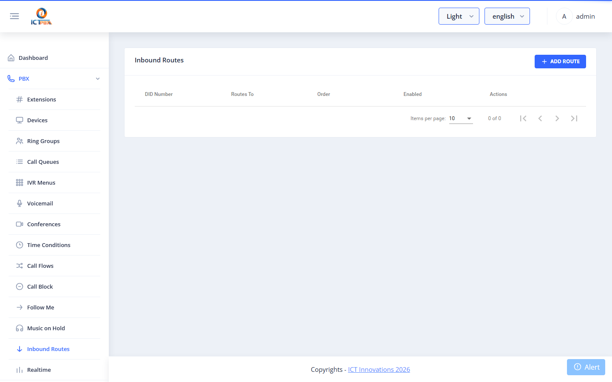

### Add / Edit Inbound Route

| Field | Required | Description |
|-------|----------|-------------|
| DID Number | ✅ | The inbound phone number from your carrier |
| Caller ID Name | | Optional display name |
| Destination | ✅ | Where to route this number (extension, IVR, ring group, etc.) |
| Enabled | | Active/inactive |

After saving, FreeSWITCH is automatically updated to route calls to that DID to the selected destination.

---

## Gateways

Gateways (SIP Trunks) connect ICTPBX to your telecom carrier for outbound and inbound calls.

### List

Go to **PBX → Gateways**.

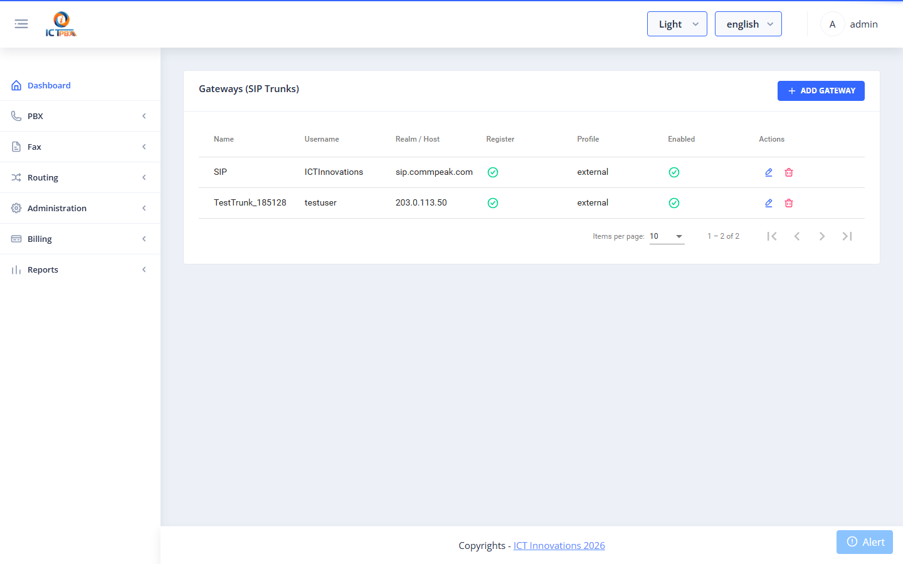

### Add / Edit Gateway

| Field | Required | Description |
|-------|----------|-------------|
| Name | ✅ | Unique gateway name (used in FreeSWITCH config) |
| Username | ✅ | SIP username provided by your carrier |
| Password | ✅ | SIP password |
| Proxy / Realm | ✅ | Carrier SIP server address |
| From Domain | | SIP domain in From header |
| Register | | Whether to register with the carrier (`true` for most hosted trunks) |
| Fax Support | | Enables T.38 fax codec negotiation on this trunk |
| Enabled | | Active/inactive |

After saving, ICTPBX:
1. Creates/updates the gateway record in FusionPBX
2. Writes the SIP profile XML to disk (`/etc/freeswitch/sip_profiles/external/`)
3. Reloads the FreeSWITCH external profile — the gateway goes REGED within seconds
