# 5 — PBX Features

Saving any PBX object (extension, ring group, IVR, route, trunk, ...) updates the phone system immediately — no restart required. All PBX configuration is done in the ICTPBX portal. Each feature requires the corresponding permission to be enabled on your account.

**SIP connection facts**

- Phones, softphones and trunks connect on **port 5080** (UDP or TCP). Nothing listens on 5060.
- Extension numbers are unique **within a tenant** — two tenants may both have extension `1001`.

---

## Extensions

**Permission required:** `Extensions`

Extensions are SIP endpoints (users/phones). Devices, ring groups, queue agents and voicemail boxes all point at extensions.

### List

Go to **PBX → Extensions**.

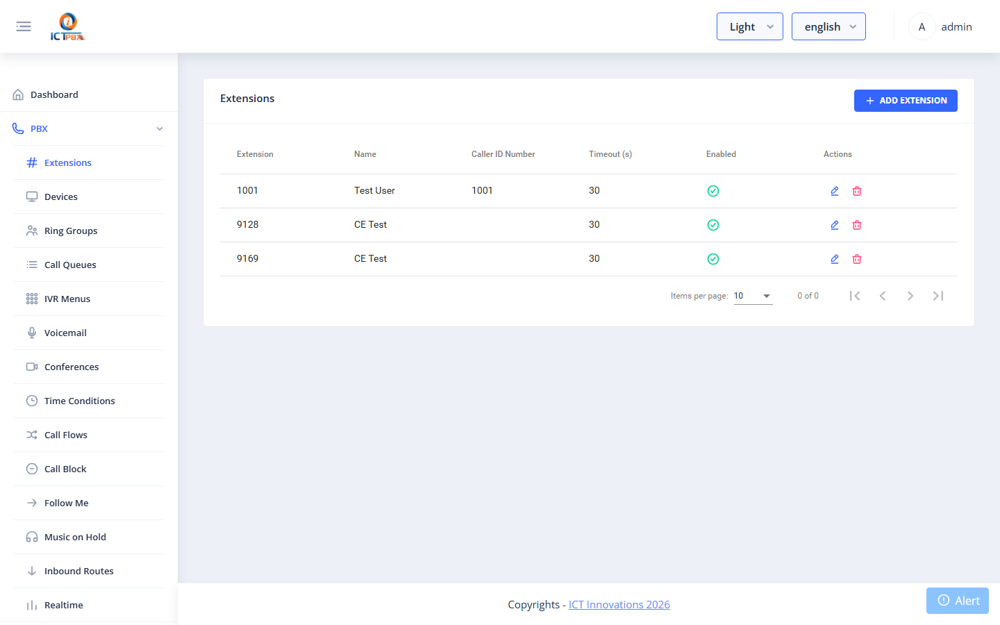

The list shows the extension number and caller ID name. Use the search bar to filter.

### Add / Edit Extension

Click **Add Extension** or the edit icon.

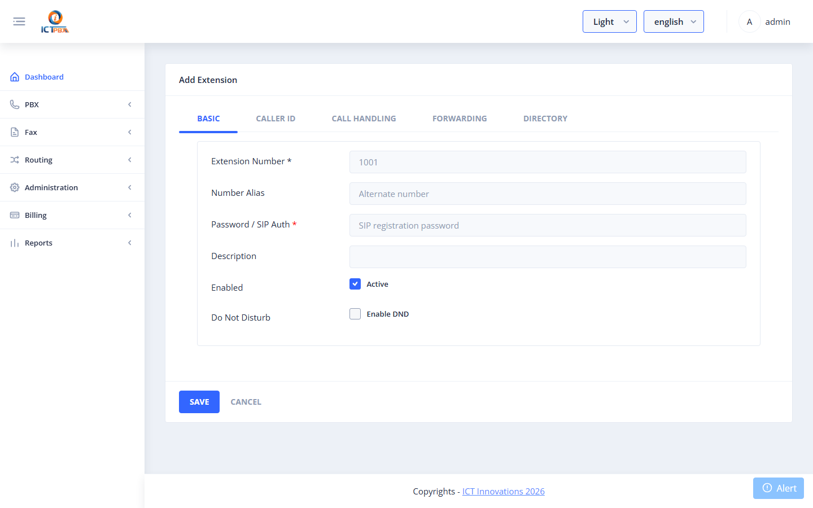

**Basic tab**

| Field | Required | Description |
|-------|----------|-------------|
| Extension Number | ✅ | The SIP extension number (e.g. `1001`) |
| Password / SIP Auth | ✅ | SIP registration password |
| Extension Type | | `Voice` (default) or `Fax` — see [Fax Features](06-fax-features.md) |
| Fax Delivery Email | | Fax extensions only — received faxes are emailed here |
| Assign to User | | Portal user who owns this extension (shown on their **My Extension** page) |
| Enabled | | Whether the extension is active |

**Other tabs**

| Tab | What it holds |
|-----|---------------|
| Caller ID | Effective / Outbound / Emergency caller ID name and number (the name shown to callers is set here) |
| Call Handling | Call Recording (`none`, `local`, `inbound`, `outbound`, `all`), Call Timeout, Do Not Disturb, Hold Music, Call Group, Toll Allow |
| Forwarding | Forward All Calls, Forward on Busy, Forward on No Answer, Forward if Not Registered — each with its own destination |
| Directory | First/Last Name, Show Extension in Directory |
| Follow Me | Ring additional destinations when this extension is called (see [Follow Me](#follow-me)) |

**Voicemail:** extensions have no voicemail fields. Create a box under **PBX → Voicemail** with Box Number = the extension number, then select it as the **No Answer Destination** / **Busy Destination** on the Forwarding tab.

### Registering a phone or softphone

| Setting | Value |
|---------|-------|
| Username | The extension number |
| Password | The SIP password |
| Domain / Realm | The tenant's SIP domain — shown on **My Extension → SIP Domain** (may differ from the portal hostname) |
| Server / Proxy | The portal hostname |
| Port | `5080` |

The built-in browser softphone connects over `wss://<portal-host>/ws/` (port 443, HTTPS required). Enter the extension and SIP password and click **Connect** — Domain is filled in automatically and the WebSocket address is prefilled.

---

## Devices

**Permission required:** `Devices`

Devices are desk phones that auto-provision from ICTPBX.

### List

Go to **PBX → Devices** (end users: **My Devices**).

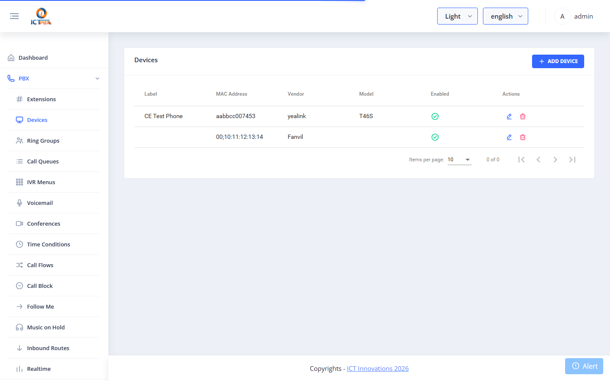

### Add / Edit Device

Click **Add Device** or the edit icon.

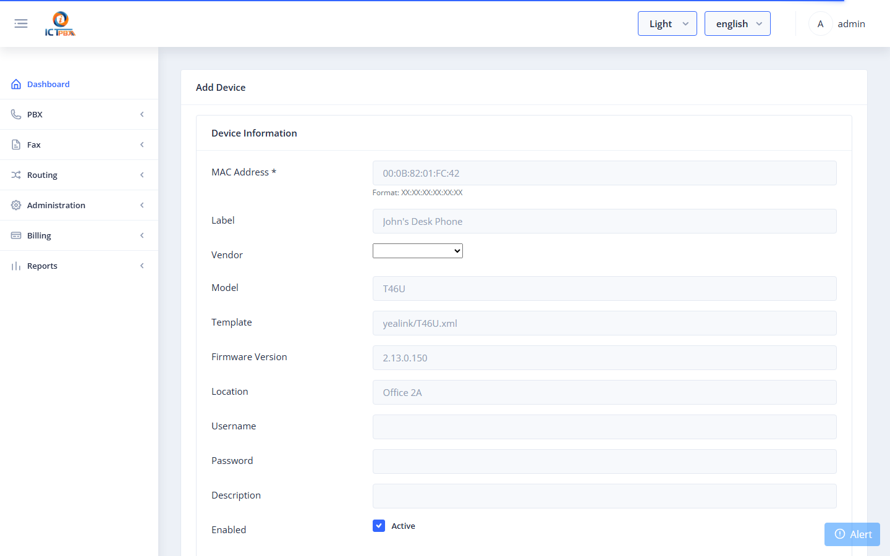

| Field | Required | Description |
|-------|----------|-------------|
| MAC Address | ✅ | Phone MAC in any format (`00:0B:82:01:FC:42`, `000b8201fc42`, ...) — stored as lowercase hex |
| Vendor / Model | | Selecting a model fills in the provisioning Template automatically |
| Device Profile | | Optional shared settings profile (**PBX → Device Profiles**) |
| Label, Location, Serial Number, Description | | Informational |
| Enabled | | Active/inactive |

**SIP Lines:** after saving, click **Add Line** and pick an extension. Server address defaults to the portal host, port `5080`. A device with **no line has no SIP account** and the phone will not register.

**Provisioning URL:** shown on the form as `https://<portal-host>/provision/<mac>` — enter it in the phone's auto-provisioning settings. The phone's web-admin password is set by provisioning; do not change it on the phone (it will be reverted on reboot).

---

## Ring Groups

**Permission required:** `Ring Groups`

Ring groups ring several destinations when one number is dialled.

### List

Go to **PBX → Ring Groups**.

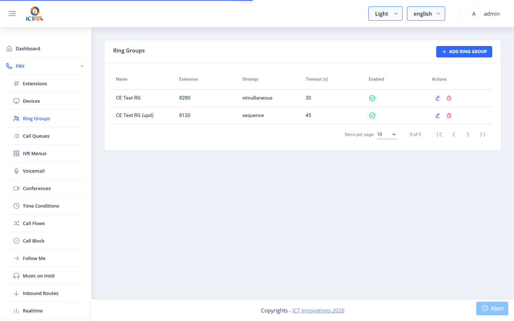

### Add / Edit Ring Group

| Field | Required | Description |
|-------|----------|-------------|
| Name | ✅ | Descriptive name |
| Extension | ✅ | The number callers dial to reach this group |
| Strategy | | `simultaneous` (all at once), `sequence` (one at a time, in order), `random`, `rollover`, `enterprise` |
| Call Timeout (sec) | | How long the group rings before giving up |
| Timeout Destination | | Where unanswered calls go (extension, ring group, IVR menu, voicemail) |
| Caller ID Name / Number | | Optional caller ID override |

**Members:** click **Add Destination** and choose an extension or an external number, each with its own delay, timeout and order.

---

## Call Queues

**Permission required:** `Call Queues`

Call queues hold callers in line and distribute them to available agents.

### List

Go to **PBX → Call Queues**.

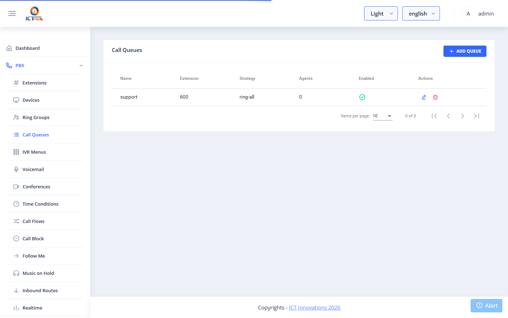

### Add / Edit Call Queue

| Field | Required | Description |
|-------|----------|-------------|
| Name | ✅ | Queue name |
| Extension | ✅ | Number callers dial to enter the queue |
| Strategy | | `ring-all`, `longest-idle-agent`, `round-robin`, `top-down`, `agent-with-least-talk-time`, `agent-with-fewest-calls`, `sequentially-by-agent-order`, `random` |
| Music on Hold | | Free text, e.g. `local_stream://moh` |
| Max Wait Time (s) | | Seconds before the timeout action runs (`0` = unlimited) |
| Timeout Action | | `Hang Up` or `Transfer to` an extension |
| Announce Frequency, CID Prefix, Agents Can Reject | | Optional tuning |

**Agents tab:** click **Add Agent** — Contact = the agent's extension, plus Call Timeout and Status.

---

## IVR Menus

**Permission required:** `IVR Menus`

IVR menus play a greeting and route callers by keypad choice.

### List

Go to **PBX → IVR Menus**.

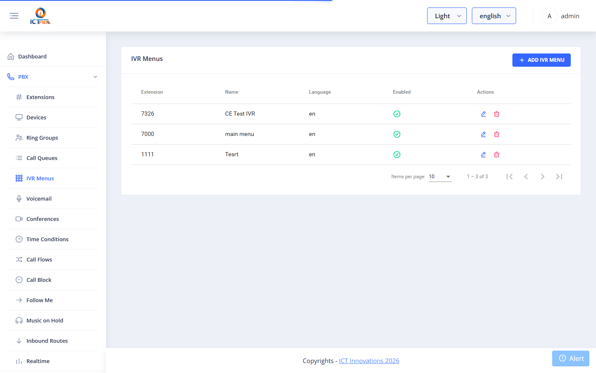

### Add / Edit IVR Menu

**Settings tab**

| Field | Required | Description |
|-------|----------|-------------|
| Name | ✅ | Menu name |
| Extension | ✅ | Number that reaches this menu |
| Greeting (long) / Greeting (short) | | Played on entry / on repeat |
| Invalid Sound / Exit Sound | | Played on a wrong key / on exit |
| Timeout (ms) | | Wait for input, in **milliseconds** (e.g. `10000` = 10 s) |
| Max Failures / Max Timeouts | | Attempts before the exit action |
| Exit Action / Exit Destination | | Where to send callers who exhaust their attempts |
| Direct Dial | | Let callers dial an extension number directly |

**Options tab:** each option has **Digits**, **Action** and **Destination**. Destinations can be an extension, ring group or another IVR menu; actions also include voicemail, check voicemail, hangup, playback and directory.

---

## Voicemail

**Permission required:** `Voicemail`

### List

Go to **PBX → Voicemail**.

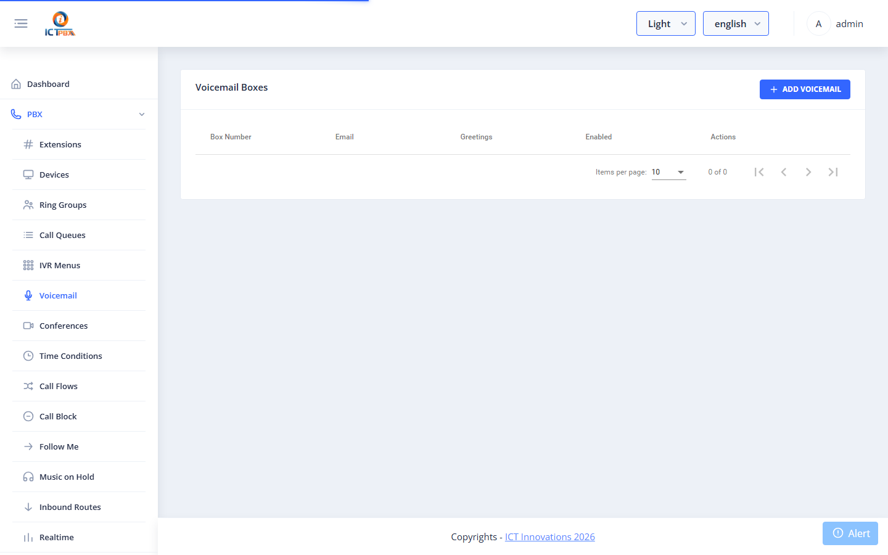

### Add / Edit Voicemail Box

| Field | Required | Description |
|-------|----------|-------------|
| Box Number | ✅ | Mailbox number — use the extension number for a user's personal box |
| Password | ✅ | PIN (digits only) for retrieving messages |
| Email (notifications) | | Address notified of new messages |
| Voicemail File | | Whether/how the recording is attached to the email |
| Keep local after email | | Keep the message on the server after emailing it |
| Enabled | | Active/inactive |

**Greetings:** after saving, open the box again to upload greetings (WAV, MP3 or OGG).

Callers reach voicemail through an extension's **Forwarding** tab (No Answer / Busy destination), an inbound route, or an IVR option. To check messages, dial `*99` followed by the mailbox number (e.g. `*991001`).

---

## Conferences

**Permission required:** `Conferences`

Conference rooms let several callers join a shared audio bridge by dialling an extension.

### List

Go to **PBX → Conferences**.

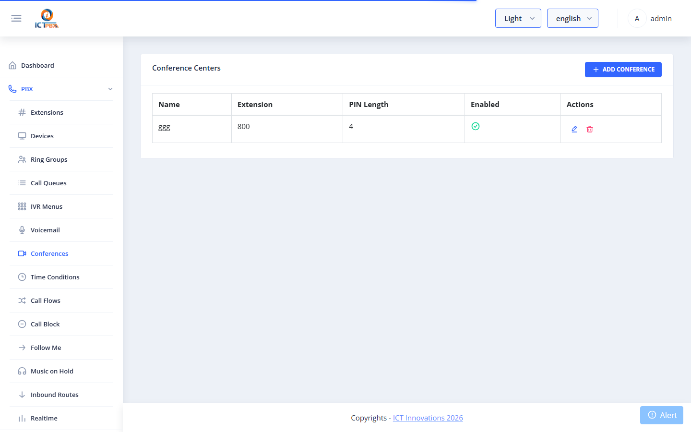

### Add / Edit Conference

| Field | Required | Description |
|-------|----------|-------------|
| Name | ✅ | Room name |
| Extension | ✅ | Number callers dial to join |
| PIN Length | | Length of the entry PIN |
| Greeting | | Optional greeting file |
| Description | | Note |
| Enabled | | Active/inactive |

**Live participants:** click the Live Participants icon on a room in the list to **Mute/Unmute** or **Kick** callers.

---

## Music on Hold

**Permission required:** `Music on Hold`

Music on Hold (MOH) plays to callers on hold or waiting in a queue. Default music is installed automatically.

### List

Go to **PBX → Music on Hold**.

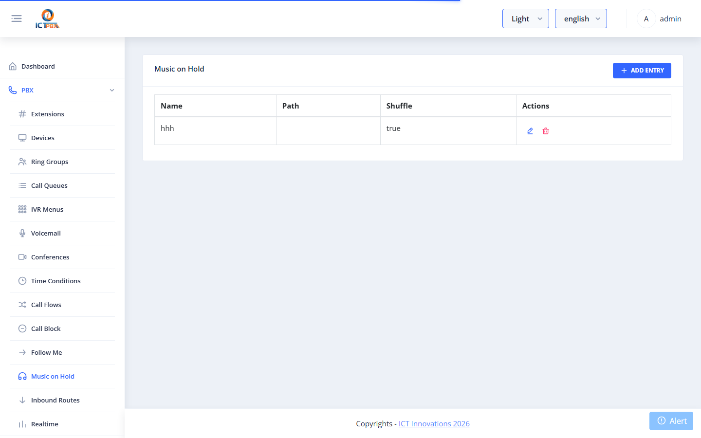

### Add / Edit MOH Category

| Field | Required | Description |
|-------|----------|-------------|
| Name | ✅ | Category name (referenced by queues and extensions) |
| Path | | Server directory holding the audio files |
| Rate (Hz) | | Audio sample rate |
| Shuffle | | Play files in random order |
| Channels, Interval (ms), Timer Name | | Advanced playback settings |

Place the audio files (WAV or MP3) in that directory on the server — ask your administrator — then enter its path here.

---

## Follow Me

**Permission required:** `Follow Me`

Follow Me also rings other phones (e.g. a mobile) when an extension is called.

### List

Go to **PBX → Follow Me** (or use the **Follow Me** tab on the extension).

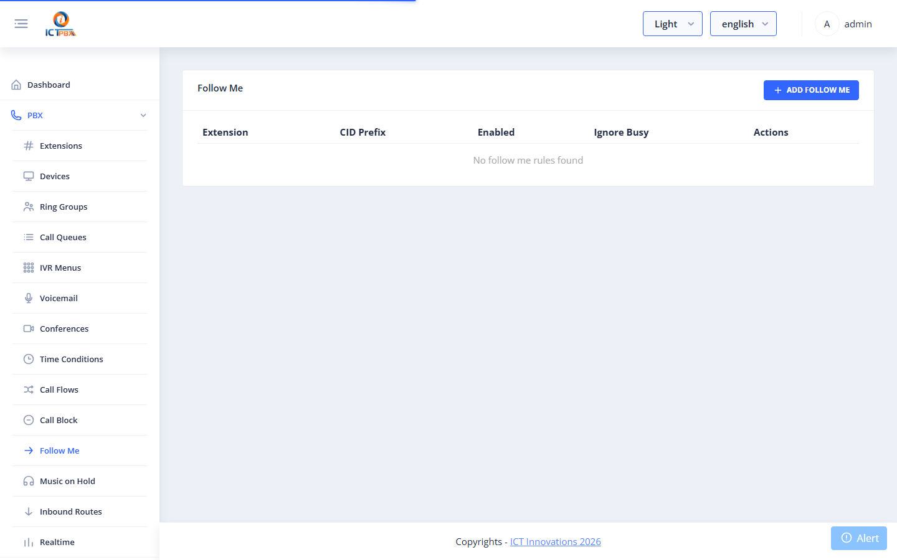

### Add / Edit Follow Me

| Field | Required | Description |
|-------|----------|-------------|
| Extension | ✅ | The extension being followed |
| Enabled | | Turn Follow Me on/off |
| Destinations | ✅ | **Add Destination** — an extension or external number, each with delay, timeout, order and an optional accept prompt |
| Caller ID Name / Number Prefix, Ignore Busy | | Optional |

Follow Me applies to direct calls, ring-group calls and IVR transfers to the extension. External numbers are dialled through your outbound routes and are billed as normal outbound calls.

---

## Call Flows

**Permission required:** `Call Flows`

A call flow is a manual day/night switch: one number routes to the **Open (Day)** destination or the **Closed (Night)** destination, depending on its current status.

### List

Go to **PBX → Call Flows**.

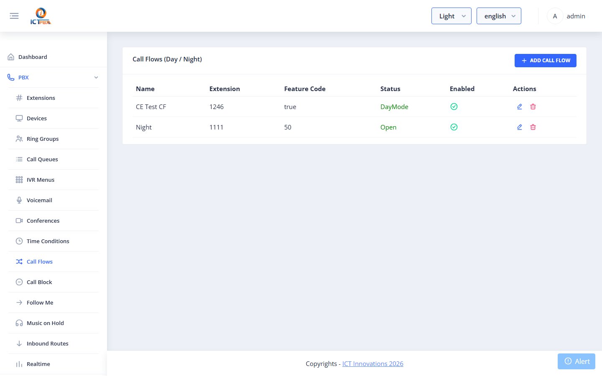

### Add / Edit Call Flow

| Field | Required | Description |
|-------|----------|-------------|
| Name | ✅ | Descriptive name |
| Extension | ✅ | The number callers reach |
| Feature Code | | Code staff dial to toggle the flow (e.g. `*5000`) |
| PIN Number | | Optional PIN required to toggle |
| Current Status | | Open (Day) or Closed (Night) |
| Open (Day) tab | ✅ | Label, destination and optional sound file for open mode |
| Closed (Night) tab | ✅ | Label, destination and optional sound file for closed mode |

Change the status in the form, or dial the feature code to toggle. Call flows are manual; for automatic schedules use [Time Conditions](#time-conditions).

---

## Time Conditions

**Permission required:** `Time Conditions`

Time conditions route calls automatically by time of day and day of week.

### List

Go to **PBX → Time Conditions**.

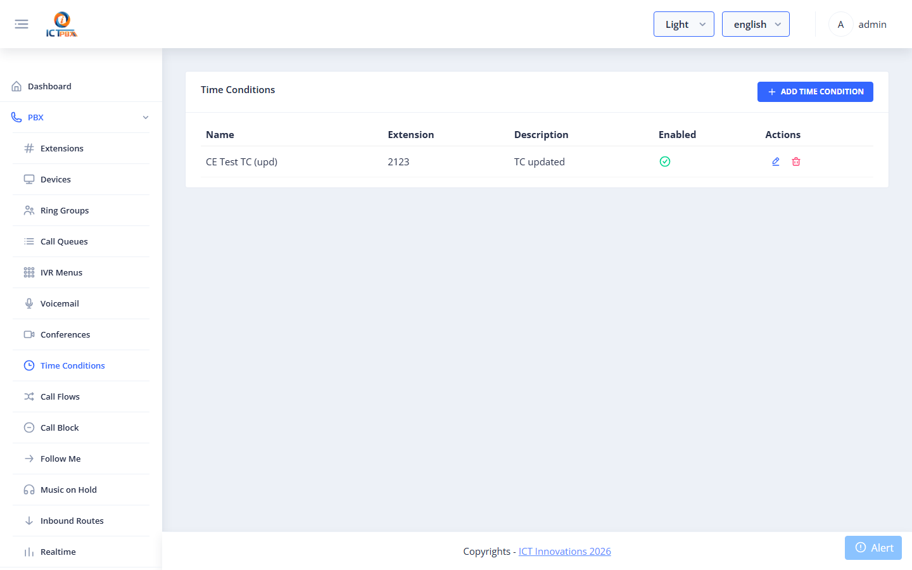

### Add / Edit Time Condition

| Field | Required | Description |
|-------|----------|-------------|
| Name | ✅ | Descriptive name (e.g. Business Hours) |
| Extension | | Number that reaches this condition |
| Time of Day | ✅ | Start and end time (e.g. `08:00`–`17:00`) |
| Day of Week | ✅ | Days the window applies to |
| Open Destination | ✅ | Where calls go inside the window |
| Closed Destination | ✅ | Where calls go outside the window |

Holidays and date ranges are not supported. To use a time condition, point an inbound route or IVR option at its extension.

---

## Call Block

**Permission required:** `Call Block`

Call Block stops calls from or to specific numbers or patterns.

### List

Go to **PBX → Call Block**.

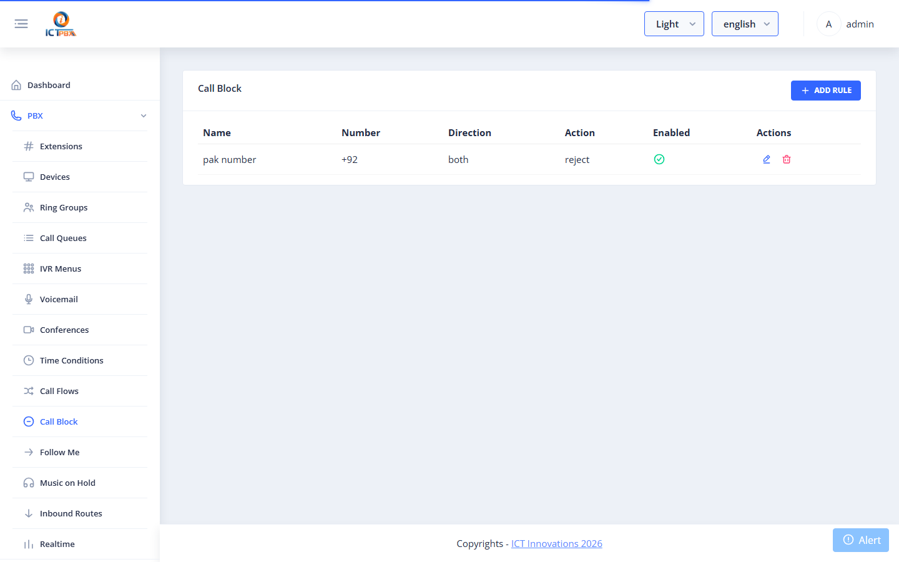

### Add / Edit Block Rule

| Field | Required | Description |
|-------|----------|-------------|
| Name | ✅ | Rule name |
| Number / Pattern | ✅ | Exact number or a regular expression (e.g. `^\+44`) |
| Direction | | `Inbound`, `Outbound` or `Both` |
| Action | | `Reject (busy)`, `Hang Up` or `Hold` |
| Country Code | | Optional country code |
| Description, Enabled | | Note / active flag |

---

## Inbound Routes

**Permission required:** `Inbound Routes`

Inbound routes send calls arriving on a DID to an internal destination.

### List

Go to **PBX → Inbound Routes**.

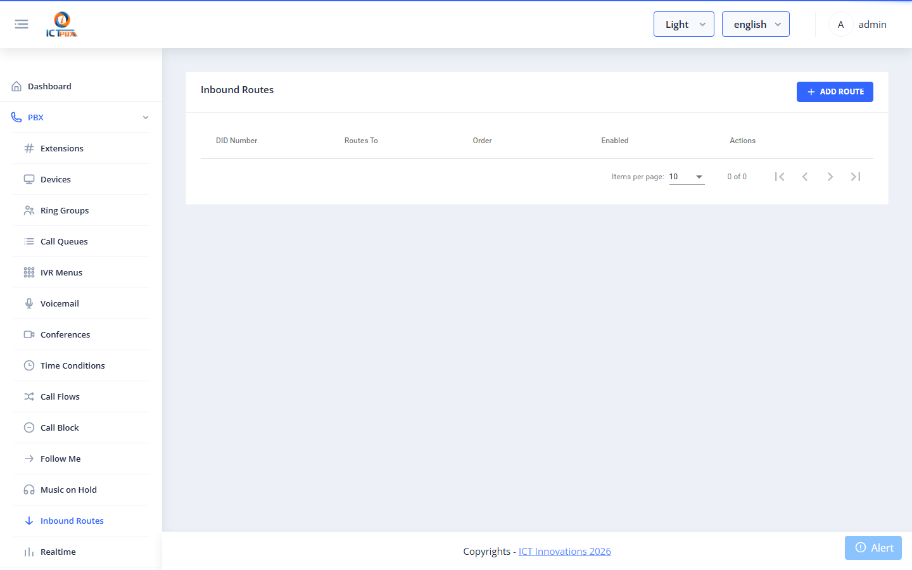

### Add / Edit Inbound Route

| Field | Required | Description |
|-------|----------|-------------|
| DID Number | ✅ | The inbound number (e.g. `+12125551234` or `12125551234`) |
| Destination Type | ✅ | `Extension`, `Ring Group`, `IVR Menu` or `Voicemail` |
| Destination | ✅ | The specific target |
| Order, Description, Enabled | | Optional |

- Only **one route per DID** — a duplicate is rejected. Changing a route's DID cleans up the old routing.
- A DID is used for voice **or** fax. A voice inbound route takes priority over fax-to-email, so do not add an inbound route for a fax DID (see [Fax Features](06-fax-features.md)).
- To reach a time condition or call flow, route the DID to an IVR option or extension that leads to it.

---

## Trunks and Outbound Routes

**Trunks** (SIP connections to your carrier) are managed under **Routing → Trunks** (Super Admin only). Saving a trunk applies it immediately. Enable **Supports Fax (T.38 / G.711 pass-through)** on trunks that carry fax.

**Outbound routes** are under **Routing → Routes**. Each route serves one service (Voice, Fax or SMS), uses one provider (trunk), and matches destinations by region/country. The outgoing caller ID comes from the trunk's **Outbound Caller ID**.

The gateways screenshot below is from an earlier release; trunks now live under Routing → Trunks.

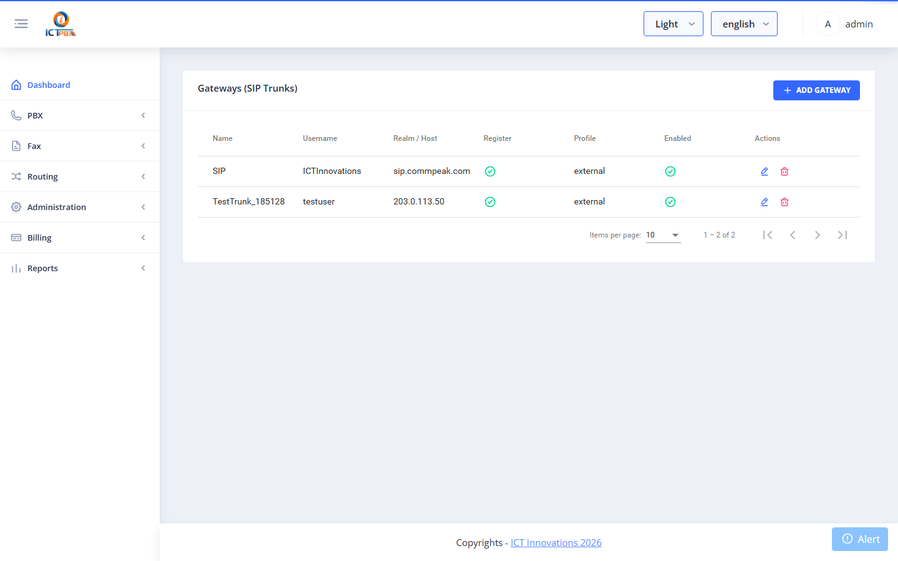

---

## Realtime

**PBX → Realtime** (admins and tenant admins) shows live activity, refreshed every 5 seconds:

- **Counters** — active calls and registrations.
- **Active Channels** — Direction, Caller ID, Destination, State, Call State, Codec, IP, with **Hangup**, **Hold/Unhold** and **Transfer** actions.
- **Registrations** — currently registered phones.
- **Click to Call** — enter a From extension and a number. The extension rings first; when answered, the number is dialled. The extension must be registered, otherwise the request is refused. Also available via API: `POST /api/call/originate` with `{"from_ext": "...", "to_number": "..."}`.

---

## Feature Codes

**PBX → Feature Codes** lists the dial codes available on your system (read-only). Common codes:

| Code | Purpose |
|------|---------|
| `*99<mailbox>` | Check voicemail (e.g. `*991001`) |
| `*99` | AI Voice Agent (Service Provider Edition add-on) |
| Call flow codes | Toggle a call flow (as set on the call flow, e.g. `*5000`) |

---

## PBX CDR

**Reports → PBX CDR** (Super Admin) lists PBX call records.

- Filter by date range and **Direction** (Inbound / Outbound / Local), then click **Apply**.
- Columns: Date/Time, Domain, Direction, Caller, Destination, Duration, Billed, Hangup Cause.
- CDR Sync runs hourly; click **Run ETL Now** to sync immediately.
