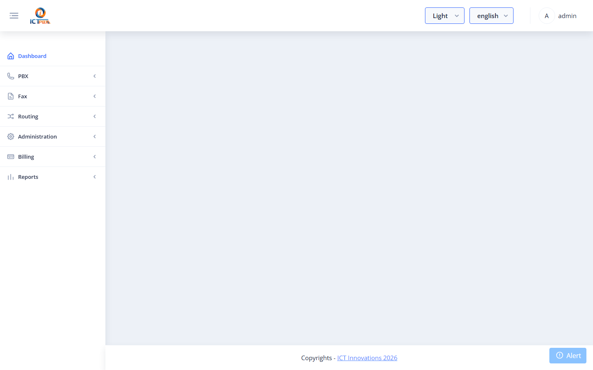
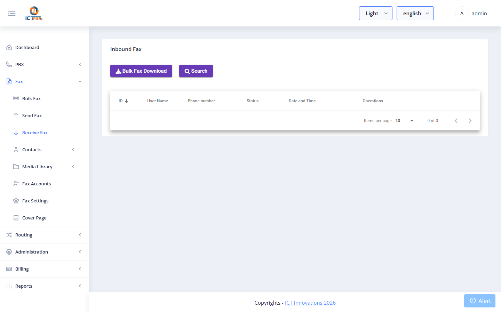
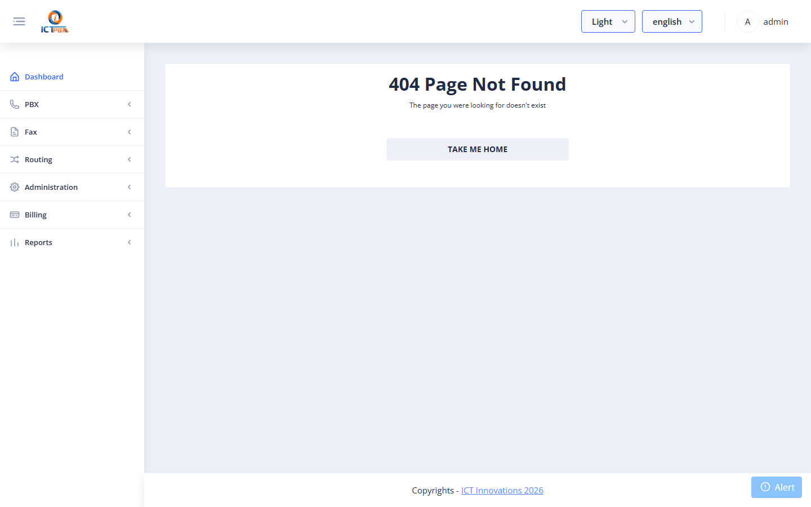

# 6 — Fax Features

ICTPBX provides a full fax pipeline: send, receive, fax-to-email delivery, DID management, and account management.

---

## Send Fax

**Permission required:** `Send Fax`

### How to Send a Fax

1. Go to **Fax → Send Fax**.

2. Fill in the form:

| Field | Required | Description |
|-------|----------|-------------|
| From Account | ✅ | The fax account to send from (your extension/DID) |
| Destination Number | ✅ | The recipient's fax number |
| Document | ✅ | PDF, TIFF, or Word document to transmit |
| Subject | | Optional fax cover reference |
| Scheduled Time | | Leave blank to send immediately; or set a future date/time |

3. Click **Send**. The fax is queued and sent within one minute by the background scheduler.

### Fax Status

After sending you can track status in **Fax → CDR** (call detail records). Status values:
- **Pending** — queued, not yet sent
- **Processing** — currently being transmitted
- **Completed** — successfully delivered
- **Failed** — transmission failed; retry manually

### Retry a Failed Fax

From the CDR view, click the retry icon on any failed transmission. A new send job is created immediately.

---

## Fax Inbox

**Permission required:** `Receive Fax`

Received faxes are stored in the inbox.

1. Go to **Fax → Inbox**.

The inbox lists received faxes with date, sender number, pages, and status. Click a row to view or download the TIFF/PDF.

### How Receiving Works

1. A call arrives at your carrier → forwarded to your ICTPBX server via SIP
2. FreeSWITCH answers the call and negotiates fax (T.38 or G.711 pass-through)
3. The received TIFF is stored and attached to a transmission record
4. If Fax-to-Email is configured, an email with the TIFF attached is sent to all linked accounts

---

## Fax to Email

**Permission required:** `Fax to Email`

Fax-to-Email automatically delivers received faxes to one or more email addresses.

### Setup

1. Create a **DID account** (type = DID) with the inbound phone number.
2. Create one or more **extension accounts** with `Link DID` pointing to that DID account, and set the `Email` field to the delivery address.

Every extension account linked to a DID receives an email with the fax attached when a fax arrives on that DID.

This enables **department fax distribution** — e.g. a single inbound number delivers to the entire sales team's inboxes.

---

## Email to Fax

**Permission required:** `Email to Fax`

Email to Fax lets users send faxes by emailing a document to a special address. The system picks up the email and transmits it as a fax automatically.

Configuration is done at the server level (SMTP polling). Contact your system administrator to set up the inbound email address for your account.

---

## Personalize Fax

**Permission required:** `Personalize Fax`

Allows the user to set a custom sender ID on outbound faxes — overriding the system default with their own name or company name.

Go to **Fax → Fax Settings** and set the **Sender Name** field.

---

## Bulk Fax (Campaigns)

**Permission required:** `Bulk Fax`

Campaigns allow sending the same document to a large list of recipients in one operation.

1. Go to **Fax → Campaigns**.
2. Click **Add Campaign**.
3. Upload your contact list (CSV) and select the document.
4. Set a send schedule or send immediately.

The system queues one transmission per recipient. Progress and results are tracked in the campaign detail view.

---

## Fax Accounts

**Permission required:** `Fax Accounts`

Fax accounts represent lines — either a DID (inbound number) or an extension (outbound/inbound endpoint).

### Account Types

| Type | Role |
|------|------|
| `did` | Inbound DID number — the phone number callers dial to send a fax |
| `account` | User extension — can send and receive; has SIP credentials and email delivery |
| `child_account` | Extension linked to a DID (auto-set when Link DID is populated) |

### List

Go to **Fax → Fax Accounts**.

### Add / Edit Fax Account

| Field | Required | Description |
|-------|----------|-------------|
| Phone | ✅ | For DID: the inbound phone number. For extension: the extension number. |
| Type | ✅ | `did`, `account`, or auto-set `child_account` |
| Email | | Email address for fax-to-email delivery |
| Link DID | | For extension accounts: select the DID this account receives faxes from |
| Password | | SIP/account password |
| Active | | Enabled/disabled |

### Linking an Extension to a DID

Set the **Link DID** field on an extension account to point at a DID account. This:
- Sets the account type to `child_account` automatically
- Adds this account's email to the notification list for faxes arriving on that DID

Multiple extension accounts can link to the same DID — useful for distributing one inbound number to a team.

---

## Fax Documents

**Permission required:** `Fax Documents`

Fax Documents is a personal document library. Upload frequently used documents (letterheads, forms, templates) so they are available to select when sending a fax — without re-uploading each time.

1. Go to **Fax → Fax Documents**.
2. Click **Upload** and select a file.
3. When sending a fax, choose from **My Documents** instead of uploading a new file.

---

## Fax Settings

**Permission required:** `Fax Settings`

System-level fax configuration. Go to **Fax → Fax Settings**.

| Setting | Description |
|---------|-------------|
| Sender Name | Default sender name printed on the fax header |
| Sender Number | Default sender fax number |
| Resolution | Standard (98 lpi) or Fine (196 lpi) |
| Header | Custom text printed at the top of each fax page |

---

## Cover Page

**Permission required:** `Cover Page`

Cover pages are automatically prepended to outgoing faxes. Go to **Fax → Cover Page** to configure the template.

Fields on the cover page template:
- Company name, logo
- To/From fields (auto-filled from transmission metadata)
- Comments / message field
- Date and time stamp
