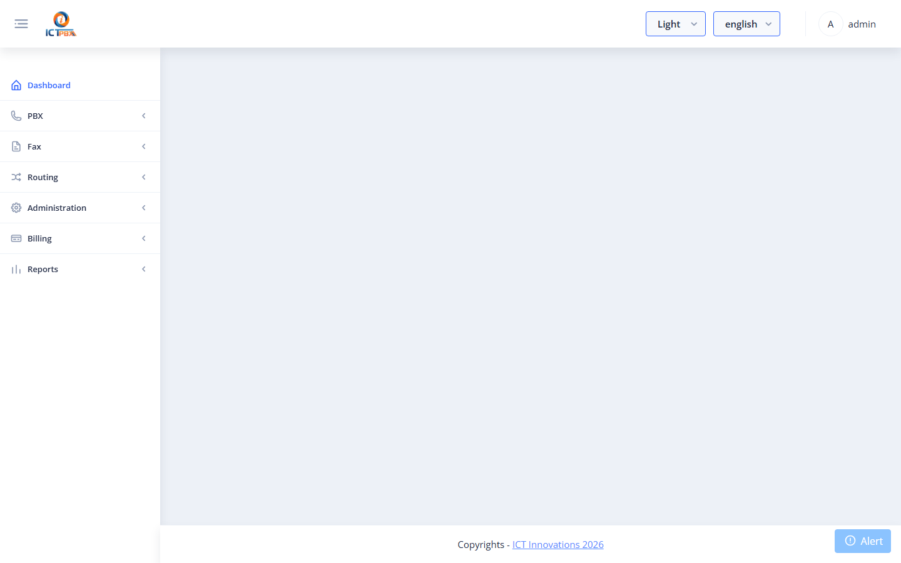
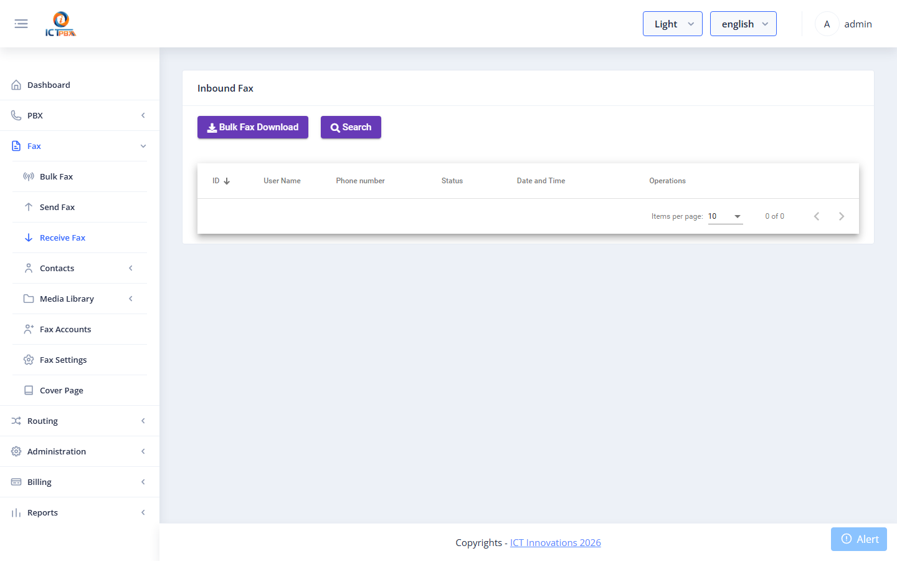

# 6 — Fax Features

ICTPBX provides a full fax pipeline: send, receive, fax-to-email delivery, bulk fax and cover pages.

Fax calls need a trunk with **Supports Fax (T.38 / G.711 pass-through)** enabled (**Routing → Trunks**) and an outbound route for the Fax service (**Routing → Routes**).

---

## Fax Lines (Fax Extensions)

A fax line is an **extension with Extension Type = Fax**.

1. Go to **PBX → Extensions → Add Extension**.
2. Set **Extension Type** to `Fax` and enter a **Fax Delivery Email**.
3. Optionally **Assign to User** so the user sees it under **Fax → My Fax Account**.

---

## Routing a DID to Fax

1. Go to **Fax → My DIDs** (admins can also use **Routing → DID Numbers**).
2. Click **Forward** on the DID.
3. Choose **Forward to Extension** and pick the fax extension, or **Fax to Email** and enter an address.

A DID is used for voice **or** fax. Do not create a voice inbound route (**PBX → Inbound Routes**) for a fax DID — a voice route takes priority and the fax will never arrive.

---

## Send Fax

**Permission required:** `Send Fax`

### How to Send a Fax

1. Go to **Fax → Send Fax** and click **New Outbound Fax**.

2. Fill in the form:

| Field | Required | Description |
|-------|----------|-------------|
| Title | ✅ | Reference for this fax |
| Document | ✅ | Upload a PDF, TIFF, image (PNG/JPG) or Word file, or pick one from Fax Documents |
| Caller ID | ✅ | One of your own fax accounts |
| Contact | ✅ | Recipient (choose a contact or enter a number) |
| Fax quality | | Standard, Fine or Super |
| Retry | | Retry automatically if the fax fails |
| Send Cover page | | Prepend a cover page (choose one with **Select Cover Page**) |
| Fax Header | | Print a header line on each page |

3. Submit. The fax is queued and transmitted by the background scheduler.

### Fax Status

The **Send Fax** list shows each fax with status **Processing**, **Completed** or **Failed**. Use the retry icon to resend a failed fax, or the download icon to get the document.

---

## Receive Fax

**Permission required:** `Receive Fax`

Go to **Fax → Receive Fax**.

Received faxes are listed with date, caller ID and destination number. Search by username or phone number, filter by date, view or download a fax, or use **Bulk Fax Download**.

If the receiving extension has a Fax Delivery Email (or the DID uses Fax to Email), each received fax is also emailed as an attachment.

---

## My Fax Account (end users)

End users see **Fax → My Fax Account** with their fax delivery email and DID. **Fax → My DIDs** and **Fax → My CIDs** are read-only for end users.

---

## Bulk Fax

**Permission required:** `Bulk Fax`

Bulk Fax sends the same document to many recipients.

1. Go to **Fax → Bulk Fax**.
2. Create a new bulk fax, select a **Contact Group** (set up under **Fax → Contacts → Contact Groups**) and the document.
3. Start it. One fax is queued per recipient; progress is shown in the list.

---

## Fax Documents

**Permission required:** `Fax Documents`

Go to **Fax → Media Library → Fax Documents** to upload frequently used documents (letterheads, forms) so they can be selected when sending a fax without re-uploading.

---

## Fax Settings

**Permission required:** `Fax Settings`

Go to **Fax → Fax Settings**.

| Setting | Description |
|---------|-------------|
| Send Cover page | Add your default cover page to outgoing faxes |
| Send Email Body as page | When faxing by email, send the email text as a page |
| Retry Fax Interval | Wait between retries (MM:SS) |

---

## Cover Page

**Permission required:** `Cover Page`

Go to **Fax → Cover Page** and click **Add CoverPage**. Enter a **Title** and the page body, and use **Set Default Cover Page** to make it the default.

Available tokens (replaced when the fax is sent):

| Token | Value |
|-------|-------|
| `[transmission:destination:first_name]`, `…:last_name`, `…:email`, `…:phone` | Recipient details |
| `[transmission:source:first_name]`, `…:last_name`, `…:email`, `…:phone` | Sender details |
| `[program:date]` | Date sent |
| `[template:subject]`, `[template:body]` | Subject and message text |

---

## Fax Billing (Service Provider Edition)

Each package includes a number of free fax pages per month. Pages beyond that are charged from the tenant's credit at the fax rate.
